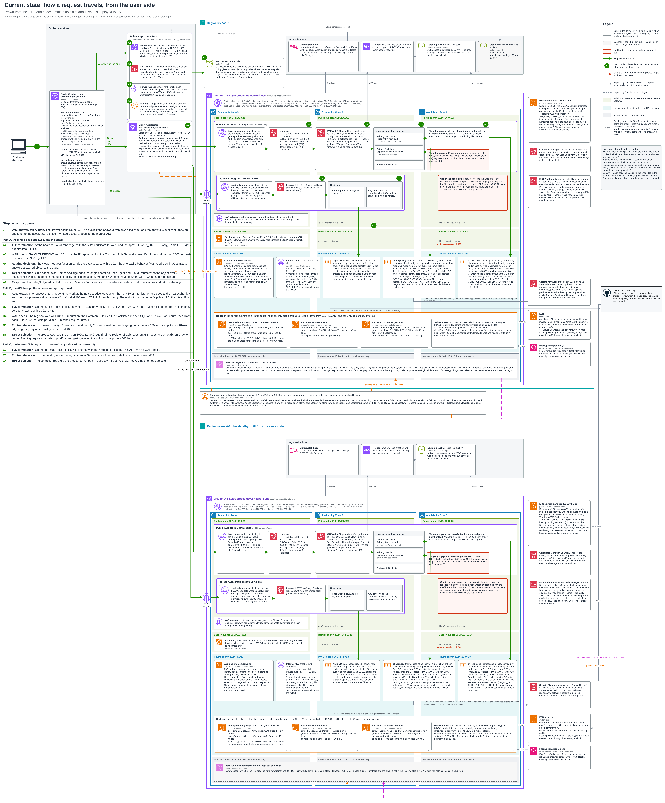
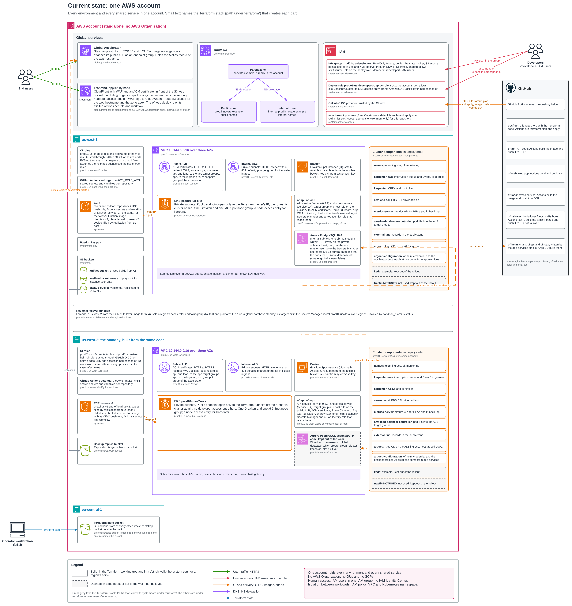
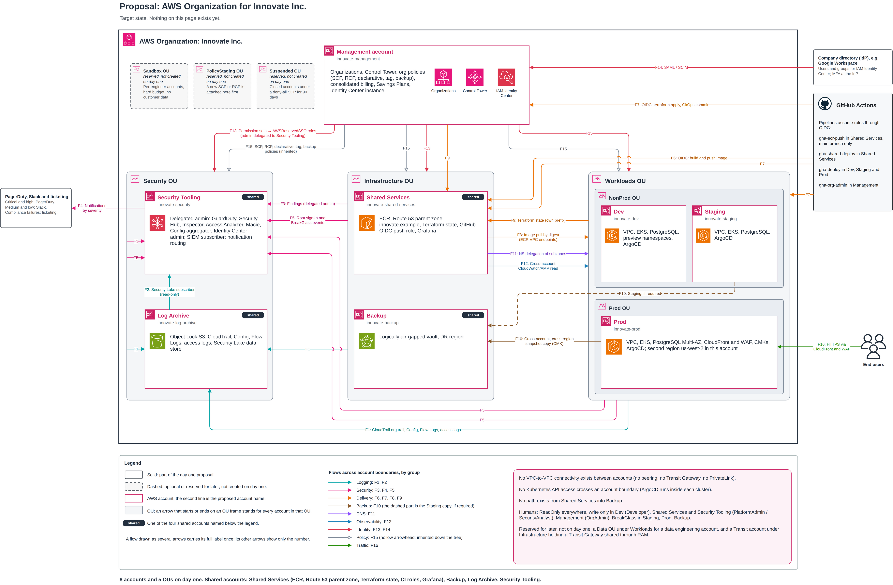
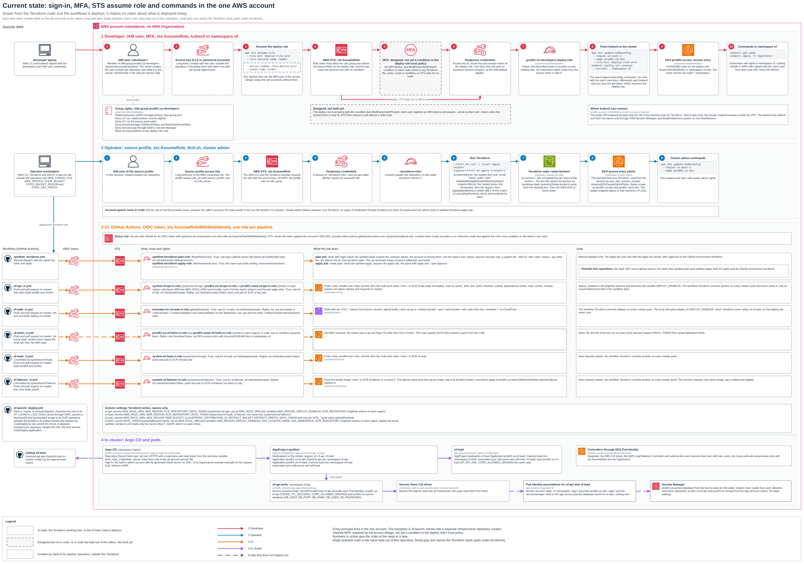
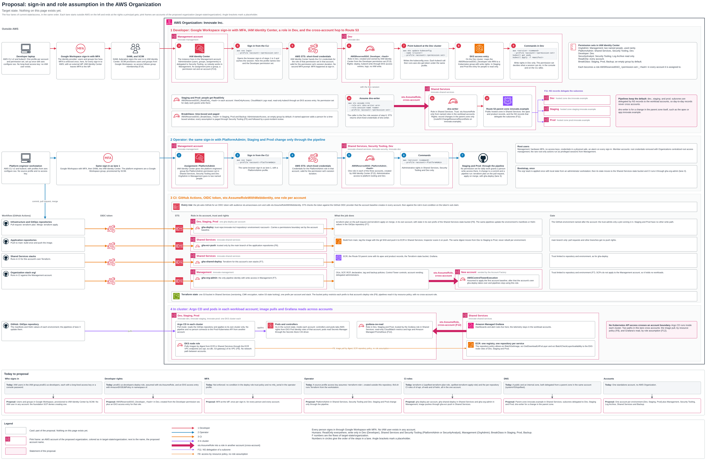

# Innovate Inc. cloud architecture

## 1. Summary

Innovate Inc. serves its React single-page app from Amazon S3 through CloudFront and its Flask REST API from Amazon EKS through Global Accelerator and an Application Load Balancer, all built by the Terraform in `terraform/`. Today one AWS account holds everything: the account-wide services (Terraform state, artifact and backup buckets, Route 53 zones, ECR, GitHub OIDC roles) and the production environment `prod01-us` in us-east-1, with a copy of that environment in us-west-2. Karpenter adds and removes x86 and Graviton nodes on Spot or On-Demand capacity, and Argo CD deploys the applications from Helm charts kept in Git. PostgreSQL is Aurora PostgreSQL Serverless v2, written as a global database across both regions and kept out of the rollout, so it is not built yet. The proposal in section 4 moves this into an AWS Organization of eight accounts with IAM Identity Center sign-in and organization policies no account administrator can undo; none of it is built yet.



Source: [current-state/infrastructure.drawio](current-state/infrastructure.drawio). Read it left to right: path A serves the web app through CloudFront, path B serves the API through the accelerator and the public ALB, path C is the Ingress ALB the AWS Load Balancer Controller builds; the numbered steps match the table in the picture.

## 2. Diagrams

Five diagrams describe the system: three show the current state as the code builds it, two show the proposal.

| Title | Viewpoint | State | Picture | Source |
|---|---|---|---|---|
| Current state: one AWS account | Organization: where each part lives and which stack creates it | Current state, from the code | [organization.png](current-state/organization.png) | [organization.drawio](current-state/organization.drawio) |
| Current state: how a request travels, from the user side | Infrastructure: DNS, edge, VPC, load balancers, EKS, Karpenter, data tier | Current state, from the code | [infrastructure.png](current-state/infrastructure.png) | [infrastructure.drawio](current-state/infrastructure.drawio) |
| Current state: sign-in, MFA, STS assume role and commands in the one AWS account | Access: developer, operator, CI and in-cluster chains | Current state, from the code | [access.png](current-state/access.png) | [access.drawio](current-state/access.drawio) |
| Proposal: AWS Organization for Innovate Inc. | Organization: OUs, accounts, shared accounts and the 16 cross-account flows | Proposal, not built yet | [organization.png](target-state/organization.png) | [organization.drawio](target-state/organization.drawio) |
| Proposal: sign-in and role assumption in the AWS Organization | Access: the same four chains through IAM Identity Center, with the cross-account hop to Route 53 | Proposal, not built yet | [access.png](target-state/access.png) | [access.drawio](target-state/access.drawio) |

To edit a diagram, open its `.drawio` file in draw.io (the desktop app or app.diagrams.net) and save it in place. The file is uncompressed XML with one page, so a change shows as a readable diff. The `.png` beside it is a render of that file: after an edit, export the page as PNG under the same name so this document shows the change.

Line styles: in the current-state diagrams a solid box or line is in the Terraform code, a dashed one is in code but kept out of the rollout or not in code at all, and a dotted one (access diagram) is created by hand or by another repository. In the proposal diagrams every part is proposed, so solid means part of the day-one proposal and dashed means optional or reserved for later.

## 3. Status markers

"Built" means in the Terraform code of this repository; "Not built yet" means proposed or planned. Code that is present but kept out of the rollout on purpose (commented out of its tier's `stacks` file) is also marked Not built yet, because no rollout creates it. A stack in no `rollout` (`global/frontend`, each region's `ci`) is Built and runs only when applied by hand. The document makes no claim about live deployment: it describes the code and the proposal, not what an AWS account holds at any moment.

Stack paths follow the diagrams: a path that starts with `system/` is under `terraform/`, every other stack path is under `terraform/environments/innovate-inc/`, and a path that starts with `cluster/`, `app-services/` or `ci/` is short for the same path under `prod01-us-east-1/`. Values that belong to one site are shown as placeholders: `<account-id>`, `<state-bucket>`, `<prefix>` (the state key prefix), `<web-bucket>`, `<artifact-bucket>`, `<ansible-bucket>`, `<edge-log-bucket>`, `<log-bucket>`, `<backup-bucket>`, `<github-owner>`, `<developer>` (an IAM user) and `<terraform-role>` (the operator's role). The DNS names use the parent zone `innovate.example`, the public zone `prod.innovate.example` and the internal zone `internal-prod.innovate.example`.

## 4. Account structure

Today one standalone AWS account holds every environment and every shared service; the proposal is an AWS Organization with eight accounts in five organizational units (OUs), built as an AWS Control Tower landing zone that Terraform manages. The proposal is Not built yet.

### 4.1 Current state: one account



Source: [current-state/organization.drawio](current-state/organization.drawio).

No stack in this repository creates or joins an AWS Organization, so the code runs in one standalone account with no OUs and no service control policies (SCPs). Workloads are kept apart by IAM policy, by VPC and by Kubernetes namespace, not by account.

| Scope | Region | Parts (stack) |
|---|---|---|
| Global services | global | Global Accelerator (`global/global-accelerator`); CloudFront site with WAF, Lambda@Edge and the web bucket (`global/frontend`, applied by name); Route 53 public and internal zones (`system/r53/opsfleet`); IAM: GitHub OIDC provider (`system/iam/github-oidc`), Terraform CI roles (`system/iam/terraform-ci`), developer group and deploy role (`system/access/developers`) |
| Account-wide, regional | us-east-1 | ECR repositories with their CI push roles (`system/ecr/of-api`, `of-load`, `frontend-web`, `helm-charts`); artifact, Ansible and backup buckets (`system/s3/*`); bastion key pair (`system/ssh-key`) |
| Terraform state | the region `STATE_BUCKET_REGION` names | state bucket (`system/s3/state-bucket`) |
| Environment `prod01-us` | us-east-1 | VPC and bastion (`prod01-us-east-1/network`), public ALB (`edge`), internal ALB (`internal-alb`), EKS (`cluster/eks`) with nine components, app services `of-api` and `of-load`, CI roles and GitHub Actions settings (`ci/roles`, `ci/github-actions`); Aurora primary in code, kept out of the rollout (Not built yet) |
| Environment `prod01-usw2` | us-west-2 | the same stacks under `prod01-us-west-2/`, with `ci/github-actions` applied by name; Aurora secondary in code, kept out of the rollout (Not built yet); the backup bucket's replica |
| Outside AWS | GitHub | repositories of-web, of-api and of-helm, private with branch protection on `master` (`system/github/*`); this repository; the of-load and of-launch repositories |

What one account means in practice:

- Human access is IAM users in one IAM group, with no IAM Identity Center (section 5).
- One bill covers every environment and every shared service.
- Every environment draws on the same account's service quotas.
- A credential that can change one environment sits in the same account as every other environment and the Terraform state.

### 4.2 Proposal: AWS Organization



Source: [target-state/organization.drawio](target-state/organization.drawio). Everything in this subsection is Not built yet.

The design rests on one rule: an account is the only hard boundary in AWS. It is at once an IAM boundary, a blast-radius boundary, a service-quota boundary, a billing boundary and a compliance-scope boundary; Kubernetes namespaces, VPCs and tags are softer boundaries on top of it. An account is created where at least one of those is needed. Accounts are grouped by function first (Security, Infrastructure, Workloads) and, inside Workloads, by environment (NonProd, Prod). Innovate Inc. builds the full skeleton with the fewest leaves, because accounts cannot be merged or split later without rebuilding the workloads inside them; the overhead of extra accounts is removed by vending and baselining them from Terraform.

```
Root
├── Management account                (directly under Root; cannot live in an OU)
├── Security OU
│   ├── Log Archive
│   └── Security Tooling              (Control Tower name: Audit)
├── Infrastructure OU
│   ├── Shared Services
│   └── Backup
└── Workloads OU
    ├── NonProd OU
    │   ├── Dev
    │   └── Staging
    └── Prod OU
        └── Prod
```

| Account (name) | OU | Why it exists | Holds | Human access |
|---|---|---|---|---|
| Management (`innovate-management`) | Root | Owns the organization and nothing else; SCPs do not apply to it, which is why it stays empty | Organizations, Control Tower, SCP, RCP, declarative, tag and backup policies, consolidated billing, Savings Plans, the Identity Center instance | `OrgAdmin` for two named people, used rarely; root user on hardware MFA in a safe |
| Log Archive (`innovate-log-archive`) | Security | Keeps evidence that must survive a compromise anywhere else, Security Tooling included | Organization CloudTrail trail, AWS Config history, VPC Flow Logs, ALB and CloudFront access logs, Security Lake data store, all under S3 Object Lock | Nobody day to day; `SecurityAnalyst` read-only during investigations |
| Security Tooling (`innovate-security`) | Security | The security team's workbench; kept apart from Log Archive so the account with the strongest cross-account roles does not also hold the evidence | Delegated administrator for GuardDuty, Security Hub, Inspector, IAM Access Analyzer, Macie, the Config aggregator and Identity Center administration; the SIEM; notification routing | Security and platform engineers |
| Shared Services (`innovate-shared-services`) | Infrastructure | Platform tooling every environment uses, none of it holding user data | One ECR registry, the Route 53 parent zone, the Terraform state bucket, the CI roles for image push, Grafana | Platform engineers; developers read-only |
| Backup (`innovate-backup`) | Infrastructure | Survives a takeover of Prod; kept apart from Shared Services so a compromised pipeline cannot reach the backups | AWS Backup logically air-gapped vault in the DR region with cross-account, cross-region PostgreSQL snapshot copies | Nobody day to day; restore through `BreakGlass` or a restore pipeline |
| Dev (`innovate-dev`) | Workloads / NonProd | Integration environment with a real deployment of the product | VPC, EKS with Karpenter, a small PostgreSQL with synthetic data, Argo CD, per-pull-request preview namespaces | `Developer` and `PlatformAdmin`; a budget with a hard cap |
| Staging (`innovate-staging`) | Workloads / NonProd | Release gate with the same IAM posture as Prod, which a shared Dev account would break; its own quotas keep load tests out of Dev | VPC, EKS, PostgreSQL, Argo CD, built from the same Terraform root as Prod | `ReadOnly`; `BreakGlass` for writes |
| Prod (`innovate-prod`) | Workloads / Prod | Serves users and holds the sensitive data | VPC, EKS, PostgreSQL Multi-AZ, CloudFront and WAF, Secrets Manager, the customer managed keys (CMKs) for user data, Argo CD; the DR region of an active and DR pair also lives here | `ReadOnly`; `BreakGlass` with an alarm |

Three more OUs are reserved and not created on day one: Sandbox (per-engineer accounts with a hard budget and no path to Prod), PolicyStaging (where a new SCP or RCP is attached first) and Suspended (closed accounts under a deny-all SCP for the 90-day closure window). Deliberately not created: a network account (nothing needs VPC-to-VPC traffic), a prod-data account (it adds cross-account networking and IAM for little gain over CMK encryption, private subnets, IAM database authentication, Secrets Manager and RCPs), a data and analytics account (no analytics workload exists), an observability account (telemetry stays in each workload account) and per-engineer sandbox accounts on day one.

**Organization policies.** Attached once at the top of the tree and inherited down it, so no account administrator can undo them:

| Policy | Attached to | Effect |
|---|---|---|
| SCP | Root | Deny leaving the organization; deny stopping or changing CloudTrail, Config, GuardDuty and Security Hub except by the Control Tower and baseline roles; deny every action outside the primary and DR regions (global services excepted); deny all root-user actions; deny `iam:CreateUser` and `iam:CreateAccessKey` except by the baseline role; deny `kms:ScheduleKeyDeletion` except through `BreakGlass` |
| SCP | Security OU | Deny changes to Object Lock, bucket policies and key policies on the Log Archive buckets and keys except by the baseline role |
| SCP | Prod OU | Deny public RDS and EBS snapshots, public AMIs, `PubliclyAccessible` RDS instances and deleting AWS Backup recovery points |
| SCP (day two) | Sandbox OU | Deny assuming roles in other organization accounts, VPC peering, Transit Gateway attachments and RAM sharing |
| RCP | Root | For S3, KMS, Secrets Manager, SQS and STS, deny access unless the caller belongs to this organization (AWS service principals excepted) |
| Declarative policy | Root | IMDSv2 by default, no public AMIs, no public EBS snapshots |
| Tag policy | Root | `Environment` (`dev`, `staging`, `prod`, `shared`, `security`), `Owner`, `CostCenter` |
| Backup policy | Prod OU (and NonProd for Staging if required) | The PostgreSQL backup plan and its copy to the Backup vault in the DR region |

The NonProd OU carries only the Root SCP, so developers keep room to work in Dev.

**How the organization is built.** A Terraform stack `org/` creates the Control Tower landing zone, the OUs, the policies (JSON files rendered with `templatefile()`), the delegated administrators and the accounts, through the Control Tower Account Factory. CI applies it against the Management account as `gha-org-admin`. It is bootstrapped once with local state from an administrator workstation, then its state moves to the Shared Services state bucket. Each new account gets an account baseline module, applied by assuming `AWSControlTowerExecution`: the default VPC deleted in every governed region, S3 Block Public Access on, EBS encryption by default with a CMK, one CMK per data class (`user-data`, `logs`, `backups`, `platform`), the GitHub OIDC provider and a `gha-deploy` role with a permissions boundary, membership in the security services, forwarding of root sign-in and `BreakGlass` events, log retention defaults, a monthly budget alerting at 50, 80 and 100 percent, required tags, and its own prefix in the state bucket. After that, the account's `gha-deploy` role takes over. Account Factory for Terraform is not used below about 20 accounts. A pure-Terraform organization without Control Tower was rejected: the team would have to write and maintain the baseline and every detective control itself.

**Production change control.** Every change to Staging and Prod is a commit plus a pipeline run: `terraform plan` on the pull request, `terraform apply` on merge through `gha-deploy`; applications change by a commit to the GitOps repository that Argo CD inside each cluster pulls. People hold `ReadOnly` there; writes need `BreakGlass`, which is time-boxed, paged and reviewed.

**Billing.** Consolidated billing sits in Management, so each account is its own cost line in Cost Explorer without tagging work; Savings Plans bought there are shared across the organization; the baseline creates a budget per account and Cost Anomaly Detection runs at organization level. Accounts, OUs, Organizations, Control Tower, Identity Center, SCPs and RCPs cost nothing; Config recording, GuardDuty, Security Hub, Inspector, Macie, CloudTrail data events, Security Lake storage and Backup vault storage are paid by volume.

**Flows across accounts.** Sixteen flows cross account boundaries (F1 to F16 in the diagram) and none of them needs a VPC in one account to reach a VPC in another: logs go to Log Archive (F1, F2), findings and root sign-in events to Security Tooling (F3 to F5), images and Terraform runs come from GitHub Actions through OIDC (F6, F7), workloads pull images by digest from Shared Services over ECR VPC endpoints (F8), Terraform state lives in Shared Services (F9), PostgreSQL snapshots copy into Backup (F10), the parent zone delegates `dev.`, `staging.` and `prod.` subzones by NS records (F11), Grafana reads metrics across accounts (F12), Identity Center hands out roles (F13, F14), policies are inherited (F15), and users reach Prod through CloudFront and WAF (F16). "Shared" means permitted by a resource policy, not routed, which is why no peering, Transit Gateway or PrivateLink exists between the accounts and why there is no network account on day one.

**Regions.** The primary region follows where the users' data must stay, and the Root SCP's region allow-list and Control Tower's governed regions hold exactly the primary and the DR region. This repository builds us-east-1 as the primary and us-west-2 as the second region; if a DR region is adopted for compute, it lives inside the Prod account.

**When the structure grows.**

| Trigger | Change |
|---|---|
| Office VPN or Direct Connect, central egress inspection, or more than three VPCs that must reach each other | A network account under the Infrastructure OU with a Transit Gateway shared through RAM |
| Analytics or machine learning on user data | A Data OU under Workloads with its own accounts |
| SOC 2, HIPAA or PCI scope | A prod-data account separating the database from compute, and a compliance-scoped OU |
| Engineers need free experimentation | The Sandbox OU, one account per engineer, budget actions, periodic cleanup |
| A second product or team | A second Dev, Staging and Prod set under a per-team OU beneath Workloads |
| A self-hosted observability stack or an SRE team | An observability account under Infrastructure, reached through PrivateLink |
| Close to 20 accounts | Evaluate Account Factory for Terraform |

### 4.3 Today's stack to target account

Every stack in the code has a home in the proposal. The moves are Not built yet.

| Stack today | What it creates | Target account | Status |
|---|---|---|---|
| `system/s3/state-bucket` | Terraform state bucket | Shared Services: one bucket, one prefix per account and stack, a bucket policy per prefix | Not built yet |
| `system/s3/ansible-bucket` | Bastion roles and playbook | Each workload account that runs a bastion (Dev, Staging, Prod each have their own VPC) | Not built yet |
| `system/s3/artifact-bucket` | of-web build tarballs | Shared Services, next to the image registry: a build is made once and promoted | Not built yet |
| `system/s3/backup-bucket` | Versioned backup bucket with a us-west-2 replica | Backup | Not built yet |
| `system/r53/opsfleet` | Public zone `prod.innovate.example` and internal zone, delegated from `innovate.example` | Parent zone in Shared Services; `prod.` in Prod, `dev.` and `staging.` in Dev and Staging | Not built yet |
| `system/iam/github-oidc` | GitHub OIDC provider | Every account, through the account baseline | Not built yet |
| `system/iam/terraform-ci` | Plan and apply roles for this repository | `gha-deploy` in Dev, Staging and Prod; `gha-shared-deploy` in Shared Services; `gha-org-admin` in Management | Not built yet |
| `system/ssh-key` | Bastion key pair | Each workload account that runs a bastion | Not built yet |
| `system/github/of-web`, `of-api`, `of-helm` | GitHub repositories | Outside AWS; their state in the Shared Services bucket | Not built yet |
| `system/ecr/of-api`, `of-load`, `frontend-web`, `helm-charts` | ECR repositories, CI push roles, workflows | Shared Services: one registry, `gha-ecr-push` | Not built yet |
| `system/access/developers` | IAM group, deploy role, EKS access entry | Identity Center permission sets (instance in Management, administered from Security Tooling) and EKS access entries in each workload account | Not built yet |
| `global/global-accelerator` | Accelerator and the `app.` record | Prod | Not built yet |
| `global/frontend` | CloudFront, WAF, web bucket, Lambda@Edge, of-web deploy role | Prod (CloudFront and WAF edge) | Not built yet |
| `prod01-us-east-1/network` | VPC, subnets, NAT gateway, bastion | Prod; Dev and Staging get their own | Not built yet |
| `prod01-us-east-1/edge` | Public ALB, WAF, accelerator endpoint group | Prod; Dev and Staging get their own | Not built yet |
| `prod01-us-east-1/internal-alb` | Internal ALB | Each workload account | Not built yet |
| `prod01-us-east-1/aurora` (kept out) | Aurora PostgreSQL primary | Prod, Multi-AZ; Dev and Staging get their own PostgreSQL | Not built yet |
| `prod01-us-east-1/cluster/eks` | EKS cluster and managed node groups | Prod; Dev and Staging one cluster each | Not built yet |
| `prod01-us-east-1/cluster/eks/components` (nine stacks; `keda` and `traefik-NOTUSED` kept out) | Namespaces, Karpenter, EBS CSI, metrics-server, load balancer controller, external-dns, Argo CD and its configuration | Each cluster's account; Argo CD inside each cluster in pull mode | Not built yet |
| `prod01-us-east-1/app-services/of-api`, `of-load` | Target groups, host rules, certificates, records, Argo CD Applications | Each workload account | Not built yet |
| `prod01-us-east-1/ci/roles` | Per-repository OIDC roles | `gha-deploy` per workload account; image push through `gha-ecr-push` in Shared Services | Not built yet |
| `prod01-us-east-1/ci/github-actions` | Actions secrets and variables | GitHub environments per account, which `gha-deploy` trusts | Not built yet |
| `prod01-us-west-2/*` (every tier) | The second region | Prod: both regions of an active and DR pair live in the Prod account | Not built yet |

## 5. Identity and access

Today people sign in as IAM users with long-lived access keys and assume one deploy role, the operator runs Terraform through a role from a local profile, and pipelines get short-lived credentials through GitHub OIDC; the proposal replaces IAM users with IAM Identity Center and Google Workspace, with MFA enforced at the identity provider. The proposal is Not built yet.

### 5.1 Current state



Source: [current-state/access.drawio](current-state/access.drawio).

**Developer.** Code: `system/access/developers`.

**1. Membership.** An administrator adds the IAM user `<developer>` to the group `prod01-us-developers`; membership is the only per-person step, and no IAM user is created in code. The user signs in with its own long-lived access key (CLI) or password (console).

**2. Group rights.** The group grants `ReadOnlyAccess` plus `files/policies/group.json`: deny every S3 action on the state bucket and on S3 access points, deny `secretsmanager:GetSecretValue` and `BatchGetSecretValue`, deny `kms:Decrypt` through SSM or Secrets Manager, and allow `sts:AssumeRole` on the deploy role only.

**3. Assume the deploy role.**

```bash
aws sts assume-role \
  --role-arn arn:aws:iam::<account-id>:role/prod01-us-developers-deploy-role \
  --role-session-name <developer>
```

The role trusts the account root with no condition and allows only `eks:DescribeCluster`. Sessions last one hour, the IAM default, because `max_session_duration` is not set.

**4. MFA.** MFA is designed but not yet a condition in the deploy role trust policy: `files/trust/account.json` has no `aws:MultiFactorAuthPresent`, so STS issues the credentials without a code today. With the condition in place, the same call adds `--serial-number arn:aws:iam::<account-id>:mfa/<developer> --token-code <code>` ([AWS: require MFA for API access](https://docs.aws.amazon.com/IAM/latest/UserGuide/id_credentials_mfa_configure-api-require.html), [AWS CLI: assume-role](https://docs.aws.amazon.com/cli/latest/reference/sts/assume-role.html)).

**5. Point kubectl at the cluster.** The administrator hands over the `kubeconfig_command` that `./tfctl.sh system/access output developers` prints, and the developer runs it once with their own keys:

```bash
aws eks update-kubeconfig --region us-east-1 --name prod01-us-eks \
  --role-arn <deploy-role-arn>
kubectl config set-context --current --namespace of
```

With `--role-arn`, every `kubectl` call runs `aws eks get-token` as the deploy role.

**6. Kubernetes rights.** EKS maps the role through a STANDARD access entry with `AmazonEKSEditPolicy` scoped to namespace `of`; the stack refuses `kube-*` namespaces.

**7. Result.** Kubernetes edit rights in `of`, read-only AWS everywhere else minus the denies of step 2.

Where `kubectl` can connect from: the cluster's public endpoint admits only the /32 of the machine that ran Terraform, the private endpoint answers only inside the VPC, and the bastion opens only through SSM Session Manager, for which `ReadOnlyAccess` holds no `ssm:StartSession`. Developers have no access entry on the us-west-2 cluster, because `system/access` reads only the us-east-1 cluster state.

**Operator.** The operator keeps site values outside the repository in `${XDG_CONFIG_HOME:-$HOME/.config}/opsfleet/<account>.env` (picked by `OPSFLEET_ENV_FILE` or `OPSFLEET_ACCOUNT`), with `STATE_BUCKET`, `STATE_BUCKET_REGION`, `STATE_KEY_PREFIX`, `AWS_PROFILE`, `GITHUB_TOKEN` and the `TF_VAR_*` site values. `AWS_PROFILE` names a profile with `role_arn` and `source_profile` and no `mfa_serial`: the AWS CLI and the Terraform provider take the source profile's access key and call `sts:AssumeRole` on `<terraform-role>`, a role created outside this repository. `tfctl.sh` then runs each stack's `init.sh` and the Terraform verb (section 13). The EKS access entry `admin` is whatever IAM principal runs Terraform, read from the session by `aws_iam_session_context`, with `AmazonEKSClusterAdminPolicy` at cluster scope on `prod01-us-eks` and `prod01-usw2-eks`; the cluster creator gets no extra admin rights. `aws eks update-kubeconfig --region us-east-1 --name prod01-us-eks` under the operator profile gives cluster admin. No script or provider checks which account the credentials belong to; the state bucket in the env file decides it in practice, because credentials for another account cannot read that backend. Applying `cluster/eks` through the Terraform workflow would move the `admin` entry to `opsfleet-terraform-apply-role`.

**CI.** Every pipeline gets short-lived credentials through GitHub OIDC. A job with `id-token: write` asks GitHub for a token with audience `sts.amazonaws.com`; `aws-actions/configure-aws-credentials` calls `sts:AssumeRoleWithWebIdentity`; IAM checks the token against the account's provider `token.actions.githubusercontent.com` (`system/iam/github-oidc`) and the role's `sub` condition, which names the repository by owner and repository ids, `repo:<github-owner>@<owner-id>/<repository>@<repo-id>:ref:refs/heads/master`, the form GitHub presents for new repositories ([GitHub: OIDC reference](https://docs.github.com/en/actions/reference/security/oidc)). No AWS key is stored in GitHub.

| Workflow | Role (stack) | Trust | Rights | Gate |
|---|---|---|---|---|
| This repository, `.github/workflows/terraform.yml`, plan job | `opsfleet-terraform-plan-role` (`system/iam/terraform-ci`) | Default branch | `ReadOnlyAccess` | Manual dispatch with tier and stack |
| Same workflow, apply job | `opsfleet-terraform-apply-role` (`system/iam/terraform-ci`) | GitHub environment `terraform` | `AdministratorAccess` | The apply box, then approval on environment `terraform` |
| of-api `ci.yml` | `system-of-api-ci-role` (`system/ecr/of-api`), or `prod01-us-of-api-ci-role` and `prod01-usw2-of-api-ci-role` (`ci/roles`): each of those stacks writes the `AWS_ROLE_ARN` secret and the last apply wins | `master` | `ecr:GetAuthorizationToken`; push and pull on ECR `of-api` | Publishes on every push to `master` |
| of-web `ci.yml` | `innovate-inc-of-web-ci-role` (`global/frontend`) | `master` | List, put and delete in `<web-bucket>`; create and read invalidations on the distribution; put, get and list under `<artifact-bucket>/production/of-web/` | Deploys on every push to `master` |
| of-helm `ci.yml` | `prod01-us-of-helm-ci-role`, `prod01-usw2-of-helm-ci-role` (`ci/roles`), assumed by no workflow | `master` | `eks:DescribeCluster`; edit in namespace `of` | The workflow only lints |
| of-load `ci.yml` | `system-of-load-ci-role` (`system/ecr/of-load`) | `master` | `ecr:GetAuthorizationToken`; push and pull on ECR `of-load` | Publishes on every push to `master` |
| of-launch `deploy.yml` | A role from a separate infrastructure repository | | | |

The Terraform workflow also needs things this repository does not create: a Vault JWT mount `github-actions` with roles `opsfleet-plan` and `opsfleet-apply`, two key-value paths with the values a local run reads from the env file and `secrets.auto.tfvars`, and the GitHub environment `terraform`.

**In the cluster.** Argo CD reads the of-helm repository through the Secret `helm-repo` (type git, the of-helm HTTPS URL, a username and password from the sensitive variable `helm_repo_credentials`) and signs people in with its built-in `admin` account and generated initial secret, without SSO. Karpenter, the EBS CSI driver, the AWS Load Balancer Controller and external-dns each assume their own IAM role through EKS Pod Identity; each role trusts `pods.eks.amazonaws.com` with `sts:AssumeRole` and `sts:TagSession` ([AWS: Pod Identity role](https://docs.aws.amazon.com/eks/latest/userguide/pod-id-role.html)). The of-api chart mounts its database secret through the Secrets Store CSI driver with Pod Identity, but no Pod Identity association exists for its service account, so that mount is Not built yet and the secret ARN is still `CHANGEME`.

### 5.2 Proposal: IAM Identity Center



Source: [target-state/access.drawio](target-state/access.drawio). Everything in this subsection is Not built yet.

The lanes keep the order of the current state; what changes is where a person signs in and where each role lives.

**Sign-in.** The Identity Center instance lives in Management and its administration (users, groups, assignments) is delegated to Security Tooling, so nobody works in Management ([AWS: delegated administration](https://docs.aws.amazon.com/singlesignon/latest/userguide/delegated-admin.html)). The company directory is the identity provider (IdP), Google Workspace in this proposal (Okta or Microsoft Entra work the same way), connected by SAML with SCIM provisioning of users and groups ([AWS: Google Workspace](https://docs.aws.amazon.com/singlesignon/latest/userguide/gs-gwp.html)). MFA is enforced once, at Google Workspace, because Identity Center does not run its own MFA for an external IdP ([AWS: MFA in Identity Center](https://docs.aws.amazon.com/singlesignon/latest/userguide/enable-mfa.html)).

**No IAM users.** The Root SCP denies creating them; every human session is Identity Center, then a permission set, then short-lived STS credentials.

**Permission sets.** Identity Center creates a role `AWSReservedSSO_<permission-set>_<hash>` in each account a permission set is assigned to ([AWS: permission set roles](https://docs.aws.amazon.com/singlesignon/latest/userguide/referencingpermissionsets.html)).

| Permission set | Assigned in | Who | Scope |
|---|---|---|---|
| `OrgAdmin` | Management | Two named people | Organization, billing, Control Tower |
| `PlatformAdmin` | Shared Services, Security Tooling, Dev | Platform engineers | Administrative access to platform tooling and Dev |
| `Developer` | Dev | Developers | Deploy, `kubectl` write through EKS access entries, logs; no IAM write |
| `SecurityAnalyst` | Security Tooling (full on security services), Log Archive (read-only) | Security | Investigations and tuning |
| `ReadOnly` | Every account | Everyone technical | `ViewOnlyAccess`, CloudWatch Logs read, read-only EKS access entry |
| `BreakGlass` | Staging, Prod, Backup | An empty group by default | `AdministratorAccess`; a named approver adds a person for a time-boxed window, every assumption pages the security team (F5) and is followed by a post-incident review |

**Commands.** `aws configure sso` once per profile, then `aws sso login --profile <account>-<permission-set>` ([AWS CLI: SSO](https://docs.aws.amazon.com/cli/latest/userguide/cli-configure-sso.html)). `kubectl` authenticates with `aws eks get-token` under the same profile, and an EKS access entry in each account maps the `AWSReservedSSO_*` role to Kubernetes rights. A permission-set role session lasts one hour by default and can be set from one to twelve hours ([AWS: session duration](https://docs.aws.amazon.com/singlesignon/latest/userguide/howtosessionduration.html)).

**Root users.** The Management root user has hardware MFA, no access keys, credentials in a safe and an alarm on every sign-in; member-account root credentials are removed with Organizations centralized root access management.

**The cross-account hop to Route 53.** The parent zone `innovate.example` lives in Shared Services, and its apex and product records (`innovate.example`, `app.innovate.example`) belong to the Shared Services pipeline. When a person or pipeline in a workload account must change the parent zone, it assumes a narrow role in Shared Services from its own session:

```bash
aws sts assume-role --role-arn <dns-writer-arn> --role-session-name <name> \
  --profile <account>-<permission-set>
```

`dns-writer` trusts only named roles in the workload accounts and allows only `route53:ChangeResourceRecordSets` on the parent zone. Day-to-day records never take this path: the `dev.`, `staging.` and `prod.` subzones are delegated by NS records to hosted zones in Dev, Staging and Prod (F11), so each account's pipelines write their own records without crossing accounts ([AWS: routing traffic for subdomains](https://docs.aws.amazon.com/Route53/latest/DeveloperGuide/dns-routing-traffic-for-subdomains.html)). Delegation stays the default; `dns-writer` is for changes in the parent zone.

**CI.** Each workload account has `gha-deploy`, whose trust names the repository and the GitHub environment of that account and which carries a permissions boundary. Shared Services has `gha-ecr-push`, trusted only by the `main` branch of the application repositories (F6), and `gha-shared-deploy` for its own Terraform. Management has `gha-org-admin` for the organization stack, the only pipeline identity with write access there (F7).

**In the cluster.** Argo CD runs inside each cluster and pulls from the GitOps repository, so no pipeline or person reaches the Kubernetes API of Prod from another account. EKS node roles pull images by digest from ECR in Shared Services under its repository policy (F8), and Grafana in Shared Services reads metrics through the `grafana-cw-read` role in each workload account (F12).

| Topic | Today | Proposal |
|---|---|---|
| Who signs in | IAM users in `prod01-us-developers`, each with a long-lived key or a console password | Google Workspace users and groups, provisioned to Identity Center by SCIM |
| Developer rights | `prod01-us-developers-deploy-role` through `sts:AssumeRole`, edit in namespace `of` | `AWSReservedSSO_Developer_<hash>` in Dev with an EKS access entry |
| MFA | Not enforced: no condition in the trust policy, no `mfa_serial` in the operator profile | Enforced at the IdP, for every person and every account |
| Operator | A source-profile access key assumes `<terraform-role>`; `tfctl.sh` runs Terraform from a workstation | `PlatformAdmin` in Shared Services, Security Tooling and Dev; Staging and Prod change only through pipelines |
| CI roles | `terraform-ci` and the per-repository roles, all in one account | `gha-deploy` per account, `gha-ecr-push` and `gha-shared-deploy` in Shared Services, `gha-org-admin` in Management |
| DNS | One zone pair delegated from a parent in the same account | Parent zone in Shared Services, subzones delegated to the workload accounts, `dns-writer` for parent-zone changes |
| Accounts | One standalone account | One account per environment plus Management, Security Tooling, Log Archive, Shared Services and Backup |

## 6. Network and network security

Each region has one VPC, `10.144.0.0/16`, across three Availability Zones with four subnet tiers; nodes, pods and the database have no public addresses, and only the internet-facing load balancers, the NAT gateway and the bastion do. Code: `prod01-us-east-1/network` (module `network/network-1.4.1`) and its copy in `prod01-us-west-2/network`.

**VPC and zones.** The VPC `prod01-us-network-vpc` has DNS hostnames on and no Transit Gateway attachment. In us-east-1 the stack takes the first three available zones after excluding zone ID `use1-az3`, because EKS does not accept cluster subnets there ([AWS: EKS network requirements](https://docs.aws.amazon.com/eks/latest/userguide/network-reqs.html)); in us-west-2 it takes the first three available zones. Both regions use the same range, so the two VPCs can never be peered ([AWS: VPC peering basics](https://docs.aws.amazon.com/vpc/latest/peering/vpc-peering-basics.html)); nothing in the code connects them.

| Tier | CIDRs (one per zone) | Route | Holds | Discovery tags |
|---|---|---|---|---|
| Private | `10.144.0.0/18`, `10.144.64.0/18`, `10.144.128.0/18` | `0.0.0.0/0` to the NAT gateway | Nodes and pods, the EKS control plane's network interfaces, the internal ALB | `karpenter.sh/discovery = prod01-us-eks`, `kubernetes.io/role/internal-elb = 1` |
| Public | `10.144.192.0/22`, `10.144.196.0/22`, `10.144.200.0/22` | `0.0.0.0/0` to the internet gateway; public IP on launch | Public ALB, Ingress ALB, NAT gateway | `kubernetes.io/role/elb = 1` |
| Bastion | `10.144.204.0/28`, `10.144.204.16/28`, `10.144.204.32/28` | The public route table | Bastion | None |
| Internal | `10.144.208.0/22`, `10.144.212.0/22`, `10.144.216.0/22` | Local routes only | Aurora (kept out, Not built yet) | None |

`10.144.220.0` to `10.144.255.255` and the rest of `10.144.204.0/22` are unallocated.

**Routing and NAT.** Three route tables: public (internet gateway `prod01-us-network-igw`), one private table shared by the three private subnets, and internal with local routes only. One NAT gateway, `prod01-us-network-ngw` with an Elastic IP, sits in the first public subnet (`one_nat_gateway_per_az` is off). Its sharpest failure: an outage of that zone cuts outbound traffic from all three private subnets, so nodes in the healthy zones lose their route to the internet and to every AWS API that has no endpoint in the VPC, ECR included. The module already supports one NAT gateway per zone; turning it on is in section 14.

**Endpoints.** An S3 gateway endpoint is attached to all three route tables; no interface endpoint exists (the EC2 one is off). ECR stores image layers in S3, so a node fetches the image manifest from ECR through the NAT gateway and the layers from S3 through the gateway endpoint ([AWS: ECR VPC endpoints](https://docs.aws.amazon.com/AmazonECR/latest/userguide/vpc-endpoints.html)).

**Flow logs and ACLs.** VPC Flow Logs record rejected traffic only, to the CloudWatch log group `prod01-us-network-vpc-flow-logs`, kept 60 days, through a role the module creates. No network ACL is declared, so the VPC's default ACL applies. The default security group is adopted as `prod01-us-network-default-security-group-DO-NOT-USE` with no rules.

**Bastion.** A `t4g.small` Graviton instance on persistent Spot (an interruption stops it), Amazon Linux 2023 arm64 from the SSM public parameter, IMDSv2 required, encrypted root volume, in the first bastion subnet with a public IP. It accepts no inbound traffic: `bastion_allowed_cidrs = []` creates no SSH rule, and access is SSM Session Manager only, through the instance role `AmazonSSMManagedInstanceCore`. At boot its user data reads two objects from `<ansible-bucket>` (the role's only S3 right) and runs the playbook locally: the SSM agent, automatic security updates through dnf-automatic, kubectl v1.36.5 and helm v4.3.0. Its key pair `system-bastion` comes from `system/ssh-key`.

**Security groups.**

| Group | Inbound | Outbound |
|---|---|---|
| Bastion `prod01-us-network-sg` | None | All to `0.0.0.0/0` |
| Public ALB `prod01-us-edge-sg` | 80 and 443 from `0.0.0.0/0` | All to `10.144.0.0/16` |
| Internal ALB `prod01-us-internal-alb-sg` | 80 and 443 from `10.144.0.0/16` | All to `10.144.0.0/16` |
| Nodes `prod01-us-eks` (nodes also carry the EKS cluster security group) | All protocols from `10.144.0.0/16` | All to `0.0.0.0/0` |
| Service rules (`of-api`, `of-load`) | TCP 8000 from the public ALB's group to the cluster security group | |
| Database `prod01-us-aurora-aurora-sg` (kept out, Not built yet) | None | None |

**WAF.** Two web ACLs filter public traffic: one on CloudFront and one on the public ALB (section 7). The Ingress ALB that the load balancer controller builds has none.

**Encryption in transit.** Viewers reach CloudFront over TLS 1.2 or later (`TLSv1.2_2021`) and the public ALB with `ELBSecurityPolicy-TLS13-1-2-2021-06`; both redirect HTTP to HTTPS, and Lambda@Edge adds HSTS for the web app. Behind those edges traffic is plain HTTP: CloudFront to the S3 website endpoint, the ALBs to pods on port 8000, and the internal ALB, which has no HTTPS listener although its group admits 443.

**What is private.** Nodes, pods and the EKS control plane interfaces sit in private subnets; the database tier has no route out of the VPC; the cluster's private endpoint is on and its public endpoint admits one /32; the bastion takes no inbound connection.

## 7. Edge, DNS and frontend

Route 53 answers for `prod.innovate.example`: the web app's names point at CloudFront, which serves the single-page app from S3, and the API names point at Global Accelerator, which sends traffic to the public ALB in each region.

**Zones and delegation** (`system/r53/opsfleet`, module `r53/hosted-zone-1.0`). The parent zone `innovate.example` already exists and is only read. The stack creates the public zone `prod.innovate.example` and the zone `internal-prod.innovate.example`, which is public as well because no VPC is attached, and writes one NS record for each into the parent (TTL 300). Both zones carry a mail lockdown: a null MX, SPF `v=spf1 -all`, DMARC `p=reject` and a revoked DKIM record. The zone names come from site values outside the repository.

| Name | Record | Target | Stack |
|---|---|---|---|
| `web.prod.innovate.example` and the apex | A alias | CloudFront | `global/frontend` |
| `app.prod.innovate.example` | A alias | Global Accelerator | `global/global-accelerator` |
| `api.prod.innovate.example` | A alias, target health evaluated | Global Accelerator | `prod01-us-east-1/app-services/of-api` |
| `load.prod.innovate.example` | A alias | Global Accelerator | `prod01-us-east-1/app-services/of-load` |
| `argocd.prod.innovate.example` | Written by external-dns from the Argo CD Ingress | Ingress ALB | `cluster/eks/components/external-dns` |
| Certificate validation names | The record ACM asks for, TTL 60 | ACM | The stack that owns each certificate |

The internal ALB's host pattern `*.internal.prod.innovate.example` has no record, and no Route 53 health check is built.

**Certificates.** ACM issues every certificate with DNS validation in the public zone: `web.` plus the apex in us-east-1 for CloudFront (`global/frontend`), `app.` for the public ALB (`edge`), `api.` and `load.` for their services, and `argocd.` for the Ingress ALB.

**Global Accelerator** (`global/global-accelerator`). The accelerator `innovate-inc-edge-accelerator` gives the API static anycast IPv4 addresses and one listener on TCP 80 and 443 with no client affinity. Each region's edge stack attaches its public ALB as an endpoint group on that listener: traffic dial 100, weight 100, client IP preservation on, so the ALB and its WAF see the client's address. The accelerator sends each client to the nearest healthy region ([AWS: how Global Accelerator works](https://docs.aws.amazon.com/global-accelerator/latest/dg/introduction-how-it-works.html)). For an ALB endpoint, the accelerator ignores its own health check settings and counts the ALB healthy only when every target group behind it has at least one healthy target ([AWS: Global Accelerator health checks](https://docs.aws.amazon.com/global-accelerator/latest/dg/about-endpoint-groups-health-check-options.html)). When nothing is healthy, it sends traffic to a random endpoint in the nearest group ([AWS: unhealthy endpoints](https://docs.aws.amazon.com/global-accelerator/latest/dg/about-endpoints-endpoint-weights.unhealthy-endpoints.html)).

**Public ALB** (`prod01-us-east-1/edge`, module `loadbalancer/alb-09.2`).

- `prod01-us-edge`: internet-facing in the three public subnets, HTTP/2 on, invalid header fields dropped, idle timeout 60 seconds, deletion protection off.
- Listeners: HTTP 80 answers 301 to HTTPS; HTTPS 443 uses `ELBSecurityPolicy-TLS13-1-2-2021-06` with one certificate per host (SNI) and a default action of fixed 403.
- Host rules: priority 10 sends `api.` and priority 20 sends `load.` to their target groups (ip targets, HTTP 8000, health check `/healthz`), each filled by a TargetGroupBinding in its chart. Priority 100 sends `app.` to `prod01-us-edge-ingress` (ip targets, HTTP 8000, health check on 8080 `/ping`).
- WAF `prod01-us-edge-lb-web-acl`, regional, default allow, rules by priority: 2 Amazon IP reputation list, 3 Common Rule Set, 4 `blacklisted-ips` (an empty IP set), 5 SQL injection rule set, 6 Known Bad Inputs, 7 `rate-limit-per-ip` blocking above 2000 requests per client IP over the default 300-second window ([AWS: rate-based rules](https://docs.aws.amazon.com/waf/latest/developerguide/waf-rule-statement-type-rate-based-high-level-settings.html)). A blocked request gets 403.
- Logs: access logs to `<edge-log-bucket>` under `logs/`; WAF logs through Kinesis Data Firehose (encrypted) to the same bucket under `waf-logs/`, with the user-agent header redacted. The bucket blocks public access and expires objects after 180 days.

**The `app.` gap.** Only the `traefik-NOTUSED` stack, which is kept out of the rollout, registers targets in `prod01-us-edge-ingress`. On the rollout that group is empty, so a request for `app.` that arrives through the accelerator gets 503, the ALB's answer when a target group has no registered targets ([AWS: ALB troubleshooting](https://docs.aws.amazon.com/elasticloadbalancing/latest/application/load-balancer-troubleshooting.html)). The of-api Ingress serves `app.` on the Ingress ALB instead, but no record points there: the accelerator stack owns the `app.` record, and external-dns runs `upsert-only` and leaves records it does not own. The empty group also makes the accelerator count each region's ALB as unhealthy, so regional failover cannot work until it is fixed. Section 14 lists the two ways out.

**Ingress ALB.** The AWS Load Balancer Controller builds one internet-facing ALB for the Ingress group `prod01-us-eks` from the Argo CD and of-api Ingresses: ip targets, HTTPS 443 only with a redirect, health check `/healthz`, no WAF. external-dns writes `argocd.` from the Argo CD Ingress.

**Internal ALB** (`prod01-us-east-1/internal-alb`). `prod01-us-internal-alb` sits in the private subnets with one HTTP listener on 80: a default fixed 404 with a JSON body, and a rule for `*.internal.prod.innovate.example` (the fallback while `internal_ingress_hosts` is empty) to `prod01-us-internal-ingress`, which only the kept-out Traefik stack fills. Only clients inside the VPC reach it; it has no access logs and no WAF.

**CloudFront and the web bucket** (`global/frontend`, applied by hand: `cd global/frontend && ../init.sh && terraform apply`).

- Distribution: aliases `web.` and the apex; minimum protocol `TLSv1.2_2021`, SNI only; IPv6 off; `PriceClass_100`; default root object `index.html`; one cache behavior (GET and HEAD, `redirect-to-https`, compression on, `Managed-CachingOptimized`).
- Single-page app routing: 403 and 404 from the origin become `/index.html` with status 200, cached for 0 seconds, so client-side routes load.
- A CloudFront Function on viewer request answers a request for the apex with 301 to `https://web.prod.innovate.example`.
- Lambda@Edge `innovate-inc-frontend-security-headers` (Node.js 24, 128 MB, 5-second timeout, logs kept 30 days): on origin request it sets the User-Agent to the origin secret; on origin response it adds CORS for `https://web.prod.innovate.example`, HSTS `max-age=63072000; includeSubdomains; preload`, `nosniff`, X-XSS-Protection and `Referrer-Policy: same-origin`.
- Origin: the bucket's website endpoint over HTTP. The bucket policy allows `s3:GetObject` to any principal only when the User-Agent equals the origin secret, so the public-policy blocks are off and anyone who learns the secret can read the bucket. AWS's recommended setup is origin access control ([AWS: restricting access to an S3 origin](https://docs.aws.amazon.com/AmazonCloudFront/latest/DeveloperGuide/private-content-restricting-access-to-s3.html)), which the CloudFront module already offers as `origin_type = "s3-oac"` (section 14).
- WAF `innovate-inc-frontend-cf-web-acl`, scope CLOUDFRONT, default allow: 0 Amazon IP reputation list, 1 Common Rule Set, 2 Known Bad Inputs, 3 `rate-limit-per-ip` answering 429 above 2000 requests per client IP per 300 seconds. WAF logs go to CloudWatch Logs for 60 days with the `authorization` and `cookie` headers redacted.
- Access logs are off (`enable_access_logs`); switched on, they go to `<log-bucket>` through CloudWatch log delivery and expire after 180 days.
- Web bucket `<web-bucket>`: versioning on, SSE-S3, bucket owner enforced, noncurrent versions expire after 7 days keeping the newest 3, incomplete uploads are aborted after 1 day.

## 8. Compute platform

The applications run on one EKS cluster per region, Kubernetes 1.36, whose application nodes Karpenter launches on Spot or On-Demand capacity from an x86 pool and a Graviton pool; pods scale with the Horizontal Pod Autoscaler (HPA) on metrics-server, and nodes follow the pods.

### 8.1 Cluster

Code: `prod01-us-east-1/cluster/eks` with module `kubernetes/cluster-05`; the us-west-2 copy builds `prod01-usw2-eks`.

- Cluster `prod01-us-eks`, Kubernetes 1.36, control plane network interfaces in the private subnets. The private endpoint is on; the public endpoint is on and admits one /32, the address of the machine running Terraform, read from `checkip.amazonaws.com` at plan time.
- Authentication mode `API_AND_CONFIG_MAP` with access entries: `admin` (the identity that runs Terraform, cluster admin), the Karpenter node role (`EC2_LINUX`), the developers' deploy role (edit in `of`) and the CI roles (edit in one namespace each) ([AWS: access entries](https://docs.aws.amazon.com/eks/latest/userguide/creating-access-entries.html)).
- Not in code, so Not built yet: a customer managed KMS key for Kubernetes Secrets and control plane logging to CloudWatch.
- The cluster's IAM OIDC provider exists, but no role trusts it: every controller uses Pod Identity instead of IRSA.

| Managed node group | Architecture and AMI | Instance types | Capacity | Size (desired, min, max) | Labels |
|---|---|---|---|---|---|
| `spot-arm-ng-1` | arm64 (Graviton), `AL2023_ARM_64_STANDARD` | `t4g.large` | Spot | 1, 1, 10 | `role=system`, `type=spot-arm-1`, `capacity-type=spot` |
| `spot-x86-ng-1` | x86_64, `AL2023_x86_64_STANDARD` | `t3.large`, `t3a.large` | Spot | 1, 1, 10 | `role=system`, `type=spot-x86-1`, `capacity-type=spot` |

Both groups run in the private subnets with no taints, IMDSv2 required (hop limit 2), and a 150 GiB gp3 root volume asking for 100 IOPS and 125 MiB/s. Their launch template sets no `encrypted` flag and no stack turns on EBS encryption by default, so those root volumes are unencrypted unless the account setting is on. The `role=system` label is the node selector of Karpenter, the load balancer controller and metrics-server. No Cluster Autoscaler runs, so the groups stay at their desired size.

| Managed add-on | Version | Notes |
|---|---|---|
| `vpc-cni` | `v1.23.1-eksbuild.1` | Before the node groups; credentials from the node role's `AmazonEKS_CNI_Policy` |
| `kube-proxy` | `v1.36.0-eksbuild.25` | Before the node groups |
| `eks-pod-identity-agent` | `v1.4.0-eksbuild.2` | Before the node groups |
| `coredns` | `v1.14.6-eksbuild.4` | After the node groups |
| `aws-secrets-store-csi-driver-provider` | `v3.1.4-eksbuild.1` | After the node groups; syncs mounted secrets to Kubernetes Secrets |
| `aws-ebs-csi-driver` | `v1.66.0-eksbuild.1` | From the components tier |

### 8.2 Karpenter

Code: `cluster/eks/components/karpenter-aws` (IAM, interruption queue) and `cluster/eks/components/karpenter` (charts `karpenter-crd` and `karpenter` 1.14.1 in `kube-system`, controller on the system nodes with 1 CPU and 1 GiB).

| NodePool | Architecture | Capacity types | Instances | CPU limit | Weight | Taint |
|---|---|---|---|---|---|---|
| `x86` | amd64 | Spot and On-Demand | Categories c, m, r, generation above 5 | 100 vCPU | 100 | None |
| `graviton` | arm64 | Spot and On-Demand | Categories c, m, r, generation above 5 | 50 vCPU | 10 | `arch=arm64:NoSchedule` |

When several NodePools fit a pod, Karpenter uses the one with the highest weight, and within a pool it prefers Spot and falls back to On-Demand when no Spot offering is available ([Karpenter: NodePools](https://karpenter.sh/docs/concepts/nodepools/)). A pod therefore lands on `graviton` only if it tolerates the taint and either requires arm64 or does not fit `x86`. Both pools consolidate empty or underused nodes after one minute with a disruption budget of 10 percent of nodes, expire nodes after 720 hours and allow 48 hours for termination.

The EC2NodeClass `default` uses role `prod01-us-eks-karpenter-node-role`, the AMI alias `al2023@latest`, subnets and security groups found by the tag `karpenter.sh/discovery: prod01-us-eks`, IMDSv2 required with hop limit 1, and a 50 GiB encrypted gp3 root volume. Five EventBridge rules (Spot interruption warning, rebalance recommendation, instance state change, AWS Health events, capacity reservation interruption) feed an SQS queue that Karpenter reads. `create_spot_service_linked_role` is off: Spot launches need the account's Spot service-linked role to exist already.

### 8.3 Platform components

The components tier applies nine stacks in this order (`cluster/eks/components/stacks`):

| Stack | What it runs | Identity |
|---|---|---|
| `namespaces` | `ingress` (with the pod readiness gate label), `of`, `monitoring`; `ingress` and `monitoring` receive no workload today | |
| `karpenter-aws` | Karpenter's controller role, node role, interruption queue and rules | Pod Identity, `kube-system/karpenter` |
| `karpenter` | Karpenter charts, NodePools, EC2NodeClass | |
| `aws-ebs-csi` | EBS CSI driver add-on; StorageClass `gp3` as default (ext4, encrypted, 3000 IOPS, 125 MiB/s, `WaitForFirstConsumer`, expansion allowed, reclaim Delete) | Pod Identity, `AmazonEBSCSIDriverPolicy` |
| `metrics-server` | Chart 3.14.0, two replicas on the system nodes, one host each | |
| `aws-load-balancer-controller` | Chart 3.5.0 with its CRDs; ingress class `alb`; TargetGroupBindings | Pod Identity |
| `external-dns` | Chart 1.22.0; `upsert-only` on the public zone only, owner ID `prod01-us-eks`; sources Ingress and Service | Pod Identity; `route53:ChangeResourceRecordSets` on the public zone only |
| `argocd` | Argo CD chart 10.9.4 at `argocd.prod.innovate.example` behind the Ingress ALB; TLS ends at the ALB; two replicas of the controller, server and repo server | Built-in `admin`, no SSO |
| `argocd-configuration` | Repository Secret for of-helm; AppProject `opsfleet` (destinations `argocd`, `of`, `of-api`, `of-load`); Application `of-api` | |

Two stacks stay out of the rollout and are Not built yet: `keda` (KEDA chart 2.21.0, an example that scales on ALB requests per minute) and `traefik-NOTUSED` (Traefik behind both Terraform ALBs).

### 8.4 Workloads

| Workload | Namespace | Chart and source | Replicas and scaling | Requests and limits | Nodes |
|---|---|---|---|---|---|
| of-api (Flask API) | `of` | of-helm `charts/of-api` 0.2.0 with `values.yaml`, `values-opsfleet.yaml`, `values-graviton.yaml`, Argo CD Application `of-api` | 2; HPA 2 to 5 at 70 percent CPU | 100m CPU and 128Mi requested; 256Mi memory limit, no CPU limit | Graviton |
| of-api (sample service) | `of-api` | of-helm `charts/of-api`, written by `app-services/of-api` (module `kubernetes/services/service-0.3`) | 2; HPA 2 to 5 at 70 percent CPU | 100m CPU and 128Mi requested; 256Mi memory limit | x86 (`values-amd64.yaml`) |
| of-load (stress service) | `of-load` | of-helm `charts/of-load`, written by `app-services/of-load` (module `kubernetes/services/service-0.4`) | 2; HPA 2 to 20 at 70 percent CPU or 75 percent memory | 1 CPU and 256Mi requested; 1 CPU and 1Gi limits | Graviton (`values-arm64.yaml`) |

All three run as non-root with a read-only root file system, all capabilities dropped and the `RuntimeDefault` seccomp profile, with a PodDisruptionBudget of one unavailable pod and liveness and readiness probes on `/healthz`. of-api also runs an `init-db` init container and mounts its database secret through the Secrets Store CSI driver (section 5.1). The service modules create the target group, the host rule, the certificate, the A record, the security group rule, the namespace, the chart commit to of-helm and the Argo CD Application; they create no ECR repository and no IAM role, and the charts' image values are still `CHANGEME`.

### 8.5 Scaling

- **Pods.** Each chart ships an HPA (`autoscaling/v2`) that reads pod CPU and memory use from metrics-server and moves the replica count between its bounds (table above). Argo CD ignores the replica count of of-api and of-load, so the HPA owns it.
- **Nodes.** When pods are pending, Karpenter launches a node that fits them, Spot first, within each pool's CPU limit (100 vCPU for `x86`, 50 vCPU for `graviton`); when nodes are empty or underused, it consolidates them after one minute. Interruption warnings reach Karpenter through the SQS queue. The two managed node groups do not scale.
- **Event-driven scaling.** KEDA scaling on ALB requests per minute is an example in code, kept out of the rollout: Not built yet.
- **Database.** Aurora Serverless v2 scales its own capacity (section 10).

### 8.6 Resource allocation

Every container declares CPU and memory requests (table above), which Karpenter uses to size nodes and the HPA uses as the base for utilization. Each application has its own namespace, and access entries grant edit rights per namespace (`of` for developers, one namespace per CI role). NodePool CPU limits cap what each pool can launch, and the gp3 StorageClass provides volumes on demand. No ResourceQuota or LimitRange exists in code.

### 8.7 Running a workload on x86 or on Graviton

A developer picks the architecture with a node selector on `kubernetes.io/arch` and uses an image built for it; of-api's images are built for both. The of-api chart carries the two choices as values files in of-helm `charts/of-api`:

`values-x86.yaml`:

```yaml
nodeSelector:
  kubernetes.io/arch: amd64
```

`values-graviton.yaml`:

```yaml
nodeSelector:
  kubernetes.io/arch: arm64
tolerations:
  - key: arch
    operator: Equal
    value: arm64
    effect: NoSchedule
```

The toleration lets the pod onto Karpenter's Graviton nodes, which carry the `arch=arm64:NoSchedule` taint. x86 pods should set their selector as well, because the Graviton system node group has no taint and a pod without a selector can land on arm64. Adding `karpenter.sh/capacity-type: spot` to the selector keeps a pod on Karpenter's Spot nodes. The Argo CD Application `of-api` uses `values-graviton.yaml`; listing `values-x86.yaml` in its value files (`cluster/eks/components/argocd-configuration/terraform.tfvars`) moves it to x86. The service modules pick `values-<architecture>.yaml` from their `architecture` variable (`amd64` or `arm64`). `kubectl -n of get pod -o wide` shows the node each pod landed on, and [terraform/README.md](../terraform/README.md) walks through two example Deployments, one per architecture.

## 9. Containers and delivery (CI/CD)

GitHub Actions tests each service, builds its image once per architecture and pushes it to ECR with immutable tags; Argo CD deploys the Helm charts from the of-helm repository; the frontend pipeline copies the web build to S3 and invalidates CloudFront; and Terraform runs from a manually dispatched workflow with an approval before apply.

| Repository | Holds | Pipeline |
|---|---|---|
| This repository | Terraform and this document | `.github/workflows/terraform.yml` |
| of-api | Flask API, Dockerfile | `ci.yml`, committed by `system/ecr/of-api` |
| of-web | React single-page app | `ci.yml`, committed by `global/frontend` |
| of-helm | Helm charts: `of-api` and `of-load`, written by Terraform | `ci.yml` (lint only) |
| of-load | Rust stress service | `ci.yml`, committed by `system/ecr/of-load` |
| of-launch | Deploy dashboard | `deploy.yml`, from a separate infrastructure repository |
| dev-lane | Local Docker Compose lane | None; never deployed |

**Image build.** The of-api Dockerfile has two stages on `python:3.13-slim`; the runtime runs as user `app` (UID 10001, the chart's `runAsUser`) and serves `gunicorn` on port 8000. The workflow tests first (ruff and pytest against a Postgres 17 service), then builds one image per architecture on native runners (`ubuntu-24.04` for amd64, `ubuntu-24.04-arm` for arm64) with `docker build --platform linux/<arch>`, provenance and SBOM attestations off, and runs a smoke test against `/healthz`. On `master` it pushes `<sha>-amd64` and `<sha>-arm64`, skipping a tag that already exists, and `docker buildx imagetools create` joins them under the tag `<sha>`. of-load follows the same pattern after `cargo fmt`, `cargo clippy` and `cargo test`.

**Registry.** ECR in us-east-1 (`system/ecr`):

| Repository | Scan on push | Tags | Lifecycle |
|---|---|---|---|
| `of-api`, `of-load`, `frontend-web` | On | Immutable | Untagged images expire after 14 days; keep the newest 20 amd64, the newest 20 arm64 and the newest 70 overall |
| `helm-charts/of-api` (OCI charts) | Off | Immutable | Untagged artifacts expire after 14 days; keep the newest 30 chart versions |

All use AES256 encryption and no repository policy, so only this account pulls. Nodes pull with their role's ECR read policy. No workflow pushes to `helm-charts/of-api` yet: chart publishing is Not built yet.

**Helm charts.** of-helm holds `charts/of-api` (templates for the Deployment, HPA, Ingress, PodDisruptionBudget, SecretProviderClass, Service and ServiceAccount) and its values files. Its workflow installs Helm v4.3.0 and kubeconform v0.8.0, each checked against a pinned SHA-256, runs `helm lint` and validates every values file with `kubeconform -strict` against Kubernetes 1.36.0. The of-api and of-load stacks commit their charts to of-helm (`charts/of-api`, `charts/of-load`) and then leave later content changes alone.

**Argo CD.** Argo CD watches of-helm `master` and syncs each Application automatically, with prune and self-heal: `of-api` into `of`, `prod01-us-of-api` into `of-api`, `prod01-us-of-load` into `of-load`, all under the AppProject `opsfleet`.

**Release path, backend.**

1. A commit lands on `master` in of-api.
2. The workflow tests, builds both architectures, pushes `<sha>-amd64` and `<sha>-arm64` to ECR `of-api` and joins them under `<sha>`.
3. The tag reaches of-helm: nothing in code does this today, and `values-opsfleet.yaml` still holds `CHANGEME` for the image, the certificate ARN and the secret ARN. A person commits the tag, or of-launch's `eks` deploy type commits it to the service's values file and triggers an Argo CD sync.
4. Argo CD syncs `charts/of-api` into namespace `of`.
5. Nodes pull the image from ECR; readiness probes on `/healthz` decide when a new pod takes traffic.

**Frontend pipeline** (`global/frontend` commits `.github/workflows/ci.yml` and `dependabot.yml` to of-web).

1. A commit lands on `master` in of-web.
2. `build` lints, tests and builds with the `VITE_*` values Terraform writes as Actions secrets; `VITE_API_BASE_URL` (`https://app.prod.innovate.example`) and `VITE_LOAD_API_BASE_URL` (`https://load.prod.innovate.example`) are derived from the zone and the accelerator. The tarball goes to `<artifact-bucket>/production/of-web/build_<sha>.tar.gz`, where builds expire after 7 days.
3. CodeQL, dependency review (pull requests), Snyk and zizmor check the code and the workflow.
4. `deploy`, on `master` and one run at a time, syncs `assets/` with a one-year immutable cache, the rest without `index.html`, then `index.html` with `no-cache, no-store, must-revalidate`, and invalidates `/*` on CloudFront.

**Infrastructure pipeline** (`.github/workflows/terraform.yml`). An operator dispatches it with a tier, a stack and an apply box. The `plan` job authenticates to Vault with GitHub's JWT, reads the common and per-stack values, assumes the plan role and runs `./tfctl.sh <tier> plan <stack>` from `terraform/` for a system tier, or the tier's `init.sh` and `terraform plan` in `environments/innovate-inc/<tier>/<stack>` otherwise; the summary keeps only resource addresses and totals. With the box ticked, the `apply` job waits for approval on the environment `terraform`, assumes the apply role and runs the same with `apply` and auto-approve. Locally the operator runs `tfctl.sh` (section 13).

**Gates.**

| Gate | Where | Effect |
|---|---|---|
| Manual dispatch, the apply box, approval on environment `terraform` | `terraform.yml` | No infrastructure change without a person dispatching and a reviewer approving |
| `master` only | of-api, of-web, of-load workflows | Pull requests test and build; only `master` publishes or deploys |
| `deploy_enabled` (off) | `prod01-us-east-1/ci/github-actions/terraform.tfvars` | Written as the variable `DEPLOY_ENABLED` on of-api and of-helm; the workflows Terraform commits do not read it, so it gates nothing yet |
| Immutable tags | ECR | A pushed tag can never point at a different image |

**dev-lane.** A local Docker Compose lane that is never deployed: Postgres and of-api from of-api's `compose.yaml`, of-load from its own, and the of-web dev server on `127.0.0.1:5173`.

**of-launch.** A Flask deploy dashboard. Its own `deploy.yml` builds `linux/arm64` and `linux/amd64` images and deploys by CodeDeploy to one arm64 EC2 host; the role, the host and the CodeDeploy application come from a separate infrastructure repository, not from this Terraform. Its `eks` deploy type commits an image tag to a service's values file and syncs the Argo CD application; its `frontend` type deploys a web build from the artifact bucket.

## 10. Database

PostgreSQL runs on Amazon Aurora PostgreSQL Serverless v2, written as a global database with the writer in us-east-1 and a secondary in us-west-2; both stacks are kept out of the rollout, so the database, its backups, its high availability and its disaster recovery are Not built yet.

### 10.1 Why Aurora PostgreSQL

- **The application needs PostgreSQL.** The Flask API is written against it; its local lane runs `postgres:17-alpine`.
- **Storage that survives a zone.** Aurora writes every change synchronously to six storage nodes across Availability Zones, whether or not the cluster has readers, so a zone failure loses no data ([AWS: Aurora high availability](https://docs.aws.amazon.com/AmazonRDS/latest/AuroraUserGuide/Concepts.AuroraHighAvailability.html)).
- **Fast failover once a reader exists.** With a reader in another zone, Aurora promotes it when the writer fails and service is typically back in less than 60 seconds, often less than 30; with no reader, Aurora recreates the writer in the same zone, typically in less than 10 minutes (same source).
- **Capacity that follows load.** Serverless v2 capacity is set as a range of Aurora capacity units (ACUs), each about 2 GiB of memory with its CPU and networking; Aurora scales inside the range in steps as small as 0.5 ACU, up to 256 ACU, and bills the capacity in use ([AWS: how Aurora Serverless v2 works](https://docs.aws.amazon.com/AmazonRDS/latest/AuroraUserGuide/aurora-serverless-v2.how-it-works.html)). A small start and fast growth need no instance size chosen in advance.
- **A second region without running a second database by hand.** An Aurora global database replicates to secondary regions asynchronously: recovery point (RPO) typically in seconds, recovery time (RTO) in the order of minutes, and a planned switchover loses no data ([AWS: switchover and failover](https://docs.aws.amazon.com/AmazonRDS/latest/AuroraUserGuide/aurora-global-database-disaster-recovery.html)). `db.serverless` can join a global database; `db.t4g.medium` cannot.
- **Cost at idle.** 0.5 ACU at $0.12 per ACU-hour is $43.80 a month per region before storage and I/O, the lowest idle cost of any capacity that can join a global database, against $189.80 for `db.r6g.large` (Aurora Standard, on-demand, the October 2026 price list; [Aurora pricing](https://aws.amazon.com/rds/aurora/pricing/)).

### 10.2 What the code sets today

| Setting | us-east-1 primary (`prod01-us-east-1/aurora`, module `aurora/aurora-1.3.0`) | us-west-2 secondary (`prod01-us-west-2/aurora`, module `aurora/aurora-secondary-1.0.0`) |
|---|---|---|
| Rollout | Kept out: `#aurora   kept out on purpose: not to be deployed yet` | Kept out, same line |
| Engine | `aurora-postgresql` 17.11, port 5432 | Same engine and version, joined to the primary's global cluster |
| Capacity | `db.serverless`, 0.5 to 1 ACU | Same |
| Instances | One writer, no reader | One instance; global write forwarding off |
| Subnets and access | The three internal subnets; not publicly accessible; security group with no ingress rule, so nothing reaches port 5432 yet | The three internal subnets of us-west-2 |
| Encryption | Storage encrypted with the AWS managed key `aws/rds` | Storage encrypted with us-west-2's `aws/rds` key |
| Credentials | A 32-character password generated as an ephemeral value and passed write-only, so it never enters state, stored in the Secrets Manager secret `prod01-us-aurora-aurora-master` with a replica in us-west-2; database and user `of`; IAM database authentication off | None of its own |
| Global database | Creates `prod01-us-aurora-aurora-global` | Joins it |
| Backups | Retention 1 day, window 05:00 to 07:00, tags copied to snapshots | |
| Deletion | Protection off; final snapshot skipped | Protection off; final snapshot skipped |
| Maintenance | Sunday 07:30 to 09:30; minor version upgrades on | |
| Monitoring | Enhanced Monitoring every 60 seconds; Performance Insights off; no log exports | |

### 10.3 Backups, high availability and disaster recovery

| Concern | Code today | Status | What production needs |
|---|---|---|---|
| Automated backups | Retention 1 day (the Aurora default). Aurora backups are continuous and incremental and restore to any point inside the retention window, typically up to 5 minutes before now ([AWS: Aurora backups](https://docs.aws.amazon.com/AmazonRDS/latest/AuroraUserGuide/Aurora.Managing.Backups.html)) | Not built yet | `backup_retention_period` between 7 and 35 days |
| Snapshot at deletion | Skipped | Not built yet | `skip_final_snapshot` off, so destroy leaves `<cluster>-final` |
| Deletion protection | Off | Not built yet | `deletion_protection` on |
| High availability in the region | One writer: a writer failure means a new writer in the same zone, typically under 10 minutes, and a zone outage needs a new instance created by hand in another zone | Not built yet | `instance_count` of 2 or more, so a reader in another zone is promoted, typically in under a minute |
| Disaster recovery across regions | Global database with a us-west-2 secondary | Not built yet | Both stacks on the rollout, the runbook below, a decision on write forwarding |
| Copies outside the production account | None; the AWS managed key also blocks copying snapshots to another account | Not built yet | A customer managed key and the Backup account vault (section 4.2) |
| Backup bucket | `system/s3/backup-bucket`: versioned, encrypted, replicated to us-west-2 | Built | |

Other production settings the module already accepts: `allowed_security_group_ids` with the node security group (so pods can reach port 5432), `performance_insights_enabled`, `enabled_cloudwatch_logs_exports` with `postgresql`, a customer `kms_key_id`, a wider `serverlessv2_scaling` range, and `internal_dns` for writer and reader names.

### 10.4 How the second region takes over

The us-west-2 tier is on the rollout: its network, EKS, components, of-api and CI roles are Built, and its Aurora secondary is Not built yet. Aurora never promotes a secondary region by itself; an operator or an automation must call it:

```bash
aws rds switchover-global-cluster --region us-east-1 \
  --global-cluster-identifier prod01-us-aurora-aurora-global \
  --target-db-cluster-identifier <secondary-cluster-arn>

aws rds failover-global-cluster --region us-west-2 \
  --global-cluster-identifier prod01-us-aurora-aurora-global \
  --target-db-cluster-identifier <secondary-cluster-arn> \
  --allow-data-loss
```

Switchover is the planned move with no data loss; failover is the unplanned move and loses whatever had not replicated. During a failover Aurora tries to stop writes in the old region, but only on a best-effort basis, so applications should use the global writer endpoint with a DNS cache of about 5 seconds and hold writes until the endpoint has moved ([AWS: switchover and failover](https://docs.aws.amazon.com/AmazonRDS/latest/AuroraUserGuide/aurora-global-database-disaster-recovery.html)). The us-west-2 stack does not output its cluster ARN, so the ARN comes from `aws rds describe-db-clusters`.

Sharp failure cases and what each needs:

- **The edge moves, the database does not.** The accelerator shifts new connections to us-west-2 on ALB health alone, but writes there fail until someone fails the database over. Aurora PostgreSQL 16 and later can forward writes from a secondary to the primary ([AWS: write forwarding](https://docs.aws.amazon.com/AmazonRDS/latest/AuroraUserGuide/aurora-global-database-write-forwarding-apg.html)); the module has the switch `enable_global_write_forwarding`, off.
- **A database-only outage moves no traffic,** because `/healthz` answers without touching the database.
- **The two VPCs share `10.144.0.0/16`,** so us-west-2 cannot reach the us-east-1 writer endpoint across the regions; after a promotion it is us-east-1 that is cut off.
- **Both regions take traffic every day:** the traffic dial is 100 in both, so us-west-2 serves its nearby clients against a read-only secondary unless its dial is set to 0 for a standby design.

To switch Aurora on, replace the commented line in `prod01-us-east-1/stacks` with exactly `aurora`, apply it, then do the same in `prod01-us-west-2/stacks`. `tfctl.sh` drops everything after `#` and every space on a line, so removing only the `#` would turn the rest of the comment into part of the stack name.

## 11. Security

Data at rest is encrypted with AWS managed keys everywhere except the managed node groups' root volumes, traffic is TLS at every public edge, and access is least privilege by IAM role and Kubernetes namespace; detection services and the organization policies belong to the proposal and are Not built yet.

**Encryption at rest.**

| Data | Encryption |
|---|---|
| S3 buckets (state, Ansible, artifact, backup, web, logs) | SSE-S3 (AES256) or S3 default encryption; the S3 backend writes state with `encrypt` on |
| EBS | Karpenter node volumes, the bastion root and every `gp3` persistent volume are encrypted; the managed node groups' root volumes set no flag |
| ECR | AES256 |
| Aurora (Not built yet) | AWS managed key `aws/rds` |
| Secrets Manager (the Aurora secret, Not built yet) | No `kms_key_id` set, so the AWS managed key |
| Kubernetes Secrets | No envelope encryption with a customer managed key: Not built yet |
| VPC flow log group | No customer managed key |

The proposal adds one customer managed key per data class in every account (`user-data`, `logs`, `backups`, `platform`), granted to the account's own service roles only: Not built yet.

**Secrets.** No secret is in Git. Site values live outside the repository in the operator's env file; sensitive Terraform variables take their values from each tier's git-ignored `secrets.auto.tfvars`; the Terraform workflow reads them from Vault at run time, masked. Terraform writes pipeline values as GitHub Actions secrets, the database master password goes to Secrets Manager without entering state, Argo CD's repository credentials sit in a Kubernetes Secret, and pods are meant to read database credentials through the Secrets Store CSI driver.

**Least privilege.**

- Developers: `ReadOnlyAccess` with explicit denies on the state bucket, secret values and decryption, and Kubernetes edit rights in one namespace.
- Pipelines: one OIDC role per repository and job, its trust pinned to repository ids and the `master` branch or a GitHub environment, its policy limited to one ECR repository, one bucket and prefix, or one distribution. The Terraform plan role is read-only; the apply role sits behind an approval.
- Controllers: one Pod Identity role each; external-dns may change records in the public zone only.
- The bastion role may read exactly two S3 objects.

**Network isolation.** Private and internal subnets, a single /32 on the cluster's public endpoint, a bastion with no inbound rule, security groups that admit the ALBs to the pods on port 8000 only, and a database group with no ingress at all (section 6).

**Workloads.** Containers run as non-root with read-only root file systems, no Linux capabilities and the `RuntimeDefault` seccomp profile; of-api's service account token is not mounted. Instance metadata needs IMDSv2 tokens on every node (hop limit 1 on Karpenter nodes, 2 on the managed node groups).

**Supply chain.** ECR scans images on push and keeps tags immutable; of-web's pipeline runs CodeQL, dependency review, Snyk and zizmor; of-helm's pipeline verifies its tools against pinned checksums. Image builds turn provenance and SBOM attestations off.

**Known gaps** (each in section 14, Not built yet): MFA is not a condition on the deploy role; Argo CD has no SSO and sits on an internet-facing ALB without WAF; the web bucket opens to anyone with the origin secret; the managed node groups' root volumes are not encrypted by the launch template; no CloudTrail trail, GuardDuty, Security Hub or AWS Config is in code; the EKS control plane writes no logs; Terraform state has no lock.

**Detection in the proposal** (Not built yet). Security Tooling is the delegated administrator for GuardDuty (CloudTrail, VPC Flow Logs and DNS logs in every account, plus EKS audit log monitoring, EKS runtime monitoring through an agent add-on in every cluster, and RDS Protection on Aurora logins), Security Hub, Inspector (ECR scanning on push and continuously), Macie, IAM Access Analyzer and the Config aggregator. An organization CloudTrail trail and Config history land in Log Archive under Object Lock; Security Lake normalizes CloudTrail, flow logs, Route 53 resolver logs, EKS audit logs and Security Hub findings for a SIEM in Security Tooling. Findings route by severity through EventBridge and SNS to PagerDuty (critical and high), Slack (medium and low) and ticketing (compliance failures), and every root sign-in or `BreakGlass` assumption pages at once.

## 12. Observability

Today the code collects edge and network logs and the metrics the autoscalers need; dashboards, alerting, control plane logs and database insight are Not built yet, and the proposal adds them per account with one Grafana in Shared Services.

| Signal | Where it goes | Kept | Status |
|---|---|---|---|
| VPC Flow Logs, rejected traffic | CloudWatch Logs `prod01-us-network-vpc-flow-logs` | 60 days | Built |
| Public ALB access logs | `<edge-log-bucket>`, prefix `logs/` | 180 days | Built |
| Public ALB WAF logs | Kinesis Data Firehose to `<edge-log-bucket>`, prefix `waf-logs/` | 180 days | Built |
| CloudFront WAF logs | CloudWatch Logs `aws-waf-logs-innovate-inc-frontend-cf-web-acl` | 60 days | Built |
| Lambda@Edge logs | CloudWatch Logs | 30 days | Built |
| CloudFront access logs | `<log-bucket>` through CloudWatch log delivery | 180 days | Not built yet (switch off) |
| Pod and node CPU and memory | metrics-server, for the HPAs and `kubectl top` | Live only | Built |
| Deployment state | Argo CD at `argocd.prod.innovate.example` | | Built |
| Spot interruptions and rebalancing | EventBridge to Karpenter's SQS queue | | Built |
| EKS control plane logs | None | | Not built yet |
| Aurora Enhanced Monitoring | Every 60 seconds | | Not built yet (stack kept out) |
| Aurora Performance Insights and PostgreSQL logs | Off | | Not built yet |
| Application metrics, dashboards, alarms, traces | None; the `monitoring` namespace is empty | | Not built yet |

The proposal keeps two kinds of data apart (Not built yet). Monitoring, what on-call reads daily, stays in each workload account in CloudWatch and Amazon Managed Service for Prometheus, and Amazon Managed Grafana in Shared Services reads it through `grafana-cw-read` (F12). Evidence that nobody reads daily (CloudTrail, Config, flow logs, access logs) goes to Log Archive. For the database, the global database exposes the CloudWatch metric `AuroraGlobalDBRPOLag`, the replication lag a failover would lose ([AWS: switchover and failover](https://docs.aws.amazon.com/AmazonRDS/latest/AuroraUserGuide/aurora-global-database-disaster-recovery.html)).

## 13. Infrastructure as code

Everything in sections 4 to 12 that is marked Built comes from Terraform 1.16.0 stacks under `terraform/`, grouped into tiers that two `tfctl.sh` scripts apply in a fixed order, one for the system tiers and one started per region, with state in one S3 bucket.

**Layout.**

```
terraform/
  rollout                 system tiers, in apply order
  durable                 system tiers that unroll keeps
  tfctl.sh                runs the system tiers
  README.md               cluster build and the x86 or Graviton pod example
  system/                 account-wide stacks: s3, r53, iam, ssh-key, github, ecr, access
  environments/innovate-inc/
    tfctl.sh              runs one region: the shared stacks it needs, then its tiers
    global/               global-accelerator, frontend
    prod01-us-east-1/     tfctl.sh and rollout for the region; network, edge, internal-alb, aurora; cluster/; cluster/eks/components/; app-services/; ci/
    prod01-us-west-2/     the same for us-west-2
  modules/                <area>/<name>-<version>, for example network/network-1.4.1
```

**Stacks and tiers.** A stack is one Terraform root with its own state. A tier is a folder of stacks that share its `init.sh`, `provider.tf.tmpl` and `shared-variables.tf`; its `stacks` file lists the stacks in apply order, and a `rollout` file (`terraform/rollout` for the system tiers, `<region>/rollout` for a region) lists the tiers in order. `init.sh` renders the stack's `provider.auto.tf` from the template with `envsubst` (state bucket, key prefix, bucket region, environment, region, folder names), links the shared variables and the tier's git-ignored `secrets.auto.tfvars`, then runs `terraform fmt` and `terraform init`. `tfctl.sh` runs it before every verb. Every template pins Terraform 1.16.0 and the AWS provider 6.66.0.

**State backend.** One S3 bucket, `<state-bucket>`, in the region `STATE_BUCKET_REGION` names. Keys follow the code layout: `<prefix>/system/<category>/<stack>/<stack>.tfstate` and `<prefix>/environments/<environment>/<path>/<stack>.tfstate`, with `encrypt` on. The backend sets no lock, so two applies of the same stack can overlap: Not built yet (`use_lockfile`). The `system/s3/state-bucket` stack either creates the bucket or reads an existing one (`TF_VAR_create_state_bucket`), and keeps its own state on the operator's machine under `${XDG_STATE_HOME:-$HOME/.local/state}/opsfleet/`.

**`tfctl.sh`.** The system script, `terraform/tfctl.sh`:

```bash
./tfctl.sh <tier> validate|plan|apply|output|destroy|status [stack|all] [--from <stack>] [--auto-approve] [--durable]
./tfctl.sh roll [--auto-approve] [--from <tier>/<stack>]
./tfctl.sh unroll [--auto-approve] [--from <tier>/<stack>]
./tfctl.sh check [--from <tier>/<stack>]
./tfctl.sh order
```

`roll` applies every stack of every system tier in order and `unroll` destroys them in reverse; `check` runs `terraform validate` on every stack after an init that skips the backend, so it calls no AWS API; `status` reports clean, drifted or not deployed per stack; after a failure, `roll`, `unroll` and `check` print the `--from` line that resumes at the failed stack. A destroy is refused while a later stack still holds resources, and tiers listed in `durable` (every system tier) need `--durable`.

The region script, `environments/innovate-inc/<region>/tfctl.sh`, starts `environments/innovate-inc/tfctl.sh` for its own folder:

```bash
./tfctl.sh apply|plan|destroy [<stack>|all] [--from <stack>] [--auto-approve]
./tfctl.sh order
```

A stack is its path under the region (`network`, `cluster/eks`, `cluster/eks/components/karpenter`, `app-services/of-load`). `apply` walks two shared stacks first, the hosted zones (`system/r53/opsfleet`) and `global/global-accelerator`, each applied only when its plan shows changes, so the first region creates them and the second finds them and moves on; then the region's tiers in `rollout` order. `destroy` walks the same list backwards and keeps a shared stack while another region, or `global/frontend` for the zones, still holds resources. A destroy is refused while a later stack still holds resources, and a failed walk prints the `--from` line that resumes at the failed stack. The region script never touches the system tiers, `ci/` or `global/frontend`.

**Rollout order.**

- System (`terraform/rollout`): `system/s3` (state-bucket, ansible-bucket, artifact-bucket, backup-bucket), `system/r53` (opsfleet), `system/iam` (github-oidc, terraform-ci), `system` (ssh-key), `system/github` (of-web, of-api, of-helm), `system/ecr` (of-api, of-load, frontend-web, helm-charts), `system/access` (developers).
- Region (`environments/innovate-inc/<region>/rollout`, the same in both): the shared `system/r53/opsfleet` and `global/global-accelerator` when their plans show changes, then `.` (network, edge, internal-alb), `cluster` (eks), `cluster/eks/components` (the nine stacks) and `app-services` (of-api and of-load in us-east-1, of-api in us-west-2). `global/frontend` and each region's `ci` (roles, github-actions) are in no rollout and run by hand: `cd <stack> && ../init.sh && terraform apply`.

**Module versions.** A module folder carries its version in its name, and each stack pins one version by its `source` path, so a new version sits beside the old one and only the stacks that move to it change. Several versions sit side by side today: `kubernetes/services/service-0.3`, `service-0.3.1` and `service-0.4` (us-east-1 of-api, us-west-2 of-api and of-load); `aurora/aurora-1.2.1` and `aurora-1.3.0`; `loadbalancer/alb-09`, `alb-09.1` and `alb-09.2`; `network/network-1.4-merged` and `network-1.4.1`.

**Site values.** The env file sets `STATE_BUCKET`, `STATE_BUCKET_REGION`, `STATE_KEY_PREFIX`, `AWS_PROFILE`, `GITHUB_TOKEN` and the `TF_VAR_*` values: `create_state_bucket`, `ansible_bucket_name`, `parent_zone_name` (an existing public zone), `domain_name` (a subdomain of it), `bastion_public_key`, `create_provider`, `github_owner`, `edge_log_bucket_name`, `web_bucket_name` and `log_bucket_name`. Each stack's sensitive variables come from its tier's `secrets.auto.tfvars`; the values still marked `CHANGEME` in the tree are listed by `grep -rl CHANGEME --exclude=README.md .` from `terraform/`.

**Build everything from zero, in command order.** `system/access` reads the us-east-1 cluster's state, so it runs after that region; the rest of the system tiers run first.

```bash
cd terraform
./tfctl.sh order
./tfctl.sh check
for tier in system/s3 system/r53 system/iam system system/github system/ecr; do
  ./tfctl.sh "$tier" apply all
done

cd environments/innovate-inc/prod01-us-east-1
./tfctl.sh order
./tfctl.sh apply
(cd ../global/frontend && ../init.sh && terraform apply)

cd ../prod01-us-west-2
./tfctl.sh apply

cd ../../..
./tfctl.sh system/access apply all
./tfctl.sh system/access output developers
```

Each region's `ci` stacks run by hand the same way, `roles` then `github-actions`; the us-west-2 `github-actions` points the of-api and of-helm pipelines at the us-west-2 roles, because both regions write the same repository-level secret and variables and the last apply wins. Turning Aurora on is in section 10.4. The same steps run one stack at a time from GitHub Actions through `terraform.yml` (section 9).

**Tear down.** `./tfctl.sh destroy` in a region folder destroys that region bottom up (app-services, components, eks, internal-alb, edge, network), then `global/global-accelerator` and the hosted zones unless the other region, or `global/frontend` for the zones, still holds resources; `ci` and `global/frontend` are destroyed by hand first. The system tiers are durable: `unroll` keeps them, and each needs `./tfctl.sh <tier> destroy all --durable`, with `system/access` first and `system/s3` last.

## 14. Future work (Not built yet)

Each row is Not built yet; the source names the section of this document, the code or the AWS page it comes from.

| Item | What it adds | Source |
|---|---|---|
| AWS Organization with eight accounts in five OUs, Control Tower, the `org/` stack and the account baseline | Hard boundaries between environments, separate bills and quotas, organization policies no account administrator can undo | Section 4.2 |
| IAM Identity Center with Google Workspace, permission sets and `BreakGlass` | No long-lived keys for people, MFA at the IdP, time-boxed production writes | Section 5.2 |
| `dns-writer` role in Shared Services | Parent-zone changes from a workload account without an operator in Shared Services | Section 5.2 |
| `aws:MultiFactorAuthPresent` in the deploy role trust | MFA on today's developer path until Identity Center exists | Section 5.1; `system/access/developers/files/trust/account.json` |
| A developer route to the EKS API: a CIDR list on the public endpoint, SSM rights for the bastion, or a VPN | Developers run `kubectl` from their own machines | Section 5.1 |
| Developer access entry on `prod01-usw2-eks` | Developers reach the second region's cluster | `system/access` reads only the us-east-1 cluster |
| Pod Identity association for of-api's service account; real image, certificate and secret values in `values-opsfleet.yaml` | of-api can start: the CSI mount works and the chart points at real resources | Section 5.1; of-helm `charts/of-api` |
| A target for `app.`: register pods in `prod01-us-edge-ingress`, or point `app.` at the Ingress ALB | `app.` stops answering 503 and the accelerator sees healthy ALBs, so regional failover works | Section 7; `prod01-us-east-1/edge/ingress-tg.tf` |
| SSO for Argo CD and WAF on the Ingress ALB | No built-in admin password on an internet-facing ALB | Section 7; `cluster/eks/components/argocd` |
| CloudFront origin access control (`origin_type = "s3-oac"`) | A private web bucket, readable only by the distribution | Section 7; [AWS: restricting access to an S3 origin](https://docs.aws.amazon.com/AmazonCloudFront/latest/DeveloperGuide/private-content-restricting-access-to-s3.html) |
| CloudFront access logs (`enable_access_logs`) | Request logs for the web app | `global/frontend/terraform.tfvars` |
| One NAT gateway per zone (`one_nat_gateway_per_az`) | Outbound traffic that survives the loss of one zone | Section 6; `prod01-us-east-1/network/terraform.tfvars` |
| ECR interface endpoints (`ecr.api`, `ecr.dkr`) | Image pulls that stay off the NAT gateway | Section 6; proposal flow F8; [AWS: ECR VPC endpoints](https://docs.aws.amazon.com/AmazonECR/latest/userguide/vpc-endpoints.html) |
| Encrypted root volumes on the managed node groups, or EBS encryption by default | Encryption at rest on every node | Section 8.1; `modules/kubernetes/cluster-05/node.tf` |
| gp3 baseline performance on the managed node group root volumes (they ask for 100 IOPS) | The 3,000 IOPS gp3 baseline | Section 8.1; [AWS: gp3 volumes](https://docs.aws.amazon.com/ebs/latest/userguide/general-purpose.html) |
| EKS control plane logging and a customer managed key for Kubernetes Secrets | API audit trail, envelope encryption under Innovate Inc.'s own key | Section 8.1 |
| KEDA on the rollout | Pod scaling on ALB requests per minute | Section 8.5; `cluster/eks/components/stacks` |
| Aurora on the rollout with production settings: deletion protection, final snapshot, 7 to 35 days of backups, a reader in another zone, the node security group allowed, Performance Insights, PostgreSQL logs, a customer managed key, internal DNS names | A database that survives a zone and a mistake | Section 10 |
| The global database secondary, a failover runbook, a decision on write forwarding and on the us-west-2 traffic dial | Regional disaster recovery with a known RPO and RTO | Section 10.4 |
| Backup account vault with cross-account, cross-region snapshot copies under a customer managed key | Backups that survive a compromise of the production account | Section 4.2, flow F10 |
| Detection: GuardDuty, Security Hub, Inspector, Macie, IAM Access Analyzer, Config, an organization CloudTrail trail, Security Lake and a SIEM | Threat detection, compliance history and an audit trail | Section 11 |
| Monitoring: CloudWatch and Managed Prometheus per account, Managed Grafana in Shared Services, alarms and paging | Dashboards and alerts for on-call | Section 12 |
| Terraform state locking (`use_lockfile`) and a customer managed key on the state bucket | No overlapping applies; state encrypted under Innovate Inc.'s own key | Section 13 |
| Chart publishing to `helm-charts/of-api` | Versioned OCI chart releases | Section 9; `system/ecr/helm-charts` |
| An automated image-tag promotion into of-helm | A release with no hand edit between the build and Argo CD | Section 9 |
| `DEPLOY_ENABLED` read by the workflows Terraform commits | A switch that stops publishing without editing workflows | Section 9; `prod01-us-east-1/ci/github-actions` |
| Reserved OUs (Sandbox, PolicyStaging, Suspended) | Room for experiments, safe policy rollout, account closure | Section 4.2 |
| Network account with a Transit Gateway, a Data OU, a prod-data account, an observability account, Account Factory for Terraform | Growth paths, each on its trigger | Section 4.2, "When the structure grows" |

## 15. Glossary

Abbreviations and names used in this document, with what each means here.

| Term | Stands for and what it is here |
|---|---|
| Access entry | EKS's list of which IAM roles may call the cluster API and with which Kubernetes rights |
| ACL | Access control list; a network ACL filters a subnet, a web ACL is a WAF rule set, S3 ACLs are switched off by "bucket owner enforced" |
| ACM | AWS Certificate Manager; issues and renews the TLS certificates on CloudFront and the ALBs |
| ACU | Aurora capacity unit, about 2 GiB of memory with matching CPU; Serverless v2 scales between a minimum and a maximum count |
| Add-on | A cluster component EKS installs and upgrades: `vpc-cni` (pod networking), `coredns` (cluster DNS), `kube-proxy` (service routing), pod-identity-agent |
| ALB | Application Load Balancer; the public ALB behind the accelerator, the internal ALB, and the Ingress ALB the load balancer controller builds |
| AMI | Amazon Machine Image, the disk image a node boots from; `al2023@latest` is the newest Amazon Linux 2023 |
| Argo CD | GitOps controller inside the cluster; pulls the of-helm repository and applies what it finds |
| ARN | Amazon Resource Name, the full identifier of an AWS resource |
| AZ | Availability Zone, one data-center group in a region; Multi-AZ means copies in two or more |
| Baseline | The Terraform module applied to every new account: default VPC removed, encryption defaults, OIDC provider, deploy role, budget, tags |
| Bastion | The one EC2 host in the VPC an operator reaches through SSM Session Manager to get at private resources |
| BreakGlass | The time-boxed, paged permission set for writes in Staging and Prod |
| CD | Continuous delivery; here Argo CD pulling the GitOps repository into the cluster |
| CHANGEME | Placeholder for a site value that must be set before an apply |
| CI | Continuous integration; the GitHub Actions workflows that test, build, push images and run Terraform |
| CloudFront | AWS content delivery network; serves the web app from S3 with WAF and Lambda@Edge in front |
| CMK | Customer managed key, a KMS key the account creates and controls, unlike an AWS-managed key |
| Control Tower | AWS service that creates and governs the organization: landing zone, OUs, account vending, organization policies |
| CRD | Custom resource definition; teaches Kubernetes a new object type such as NodePool or TargetGroupBinding |
| CSI | Container Storage Interface; the EBS CSI driver gives pods volumes, the Secrets Store CSI driver mounts Secrets Manager values |
| Delegated administrator | The member account that runs an organization-wide service (GuardDuty, Security Hub, Identity Center) instead of Management |
| Digest | The SHA-256 hash of an image; pulling by digest pins the exact image, a tag can be moved |
| DKIM, DMARC, MX, SPF | Mail DNS records: who signs mail, what to do with failures, which servers accept mail, who may send; the zones set all four to refuse mail |
| DNS | Domain Name System; Route 53 holds the zones |
| DR | Disaster recovery; the second region and the Backup account |
| EBS | Elastic Block Store, the node and pod disks; gp3 is its general-purpose volume type |
| EC2 | Elastic Compute Cloud, the virtual machines nodes run on |
| EC2NodeClass | Karpenter object naming the AMI, subnets, security groups, role and disk a launched node gets |
| ECR | Elastic Container Registry; holds the images and OCI charts |
| EKS | Elastic Kubernetes Service, the managed Kubernetes cluster |
| EventBridge | AWS event bus; forwards Spot, health and state-change events to Karpenter's SQS queue |
| external-dns | Controller that writes Route 53 records for Kubernetes Ingresses and Services |
| F1 to F16 | The sixteen cross-account flows numbered in the organization diagram (section 4.2) |
| Flow Logs | VPC records of connections; here rejected traffic only |
| GitOps | Cluster state declared in a Git repository and pulled by a controller, not pushed by a pipeline |
| Global Accelerator | Static anycast IP addresses in front of each region's public ALB, with health-based failover between regions |
| Graviton | AWS's ARM CPUs (arm64); x86 and amd64 mean Intel and AMD |
| GuardDuty, Security Hub, Inspector, Macie, Config, Access Analyzer | AWS detective services: threat findings, finding aggregation and checks, vulnerability scans, sensitive-data discovery, configuration history, unintended-access analysis |
| Helm, chart | Kubernetes package manager; a chart is a templated set of manifests driven by a values file |
| HPA | Horizontal Pod Autoscaler; adds or removes pods on CPU or memory from metrics-server |
| HSTS | HTTP Strict Transport Security, a response header telling browsers to use HTTPS only |
| IAM | Identity and Access Management: roles, policies and, today, users and groups |
| Identity Center | IAM Identity Center, formerly AWS SSO; one sign-in through the IdP, then a permission set per account |
| IdP | Identity provider; the company directory where logins, passwords and MFA live, e.g. Google Workspace, Okta or Microsoft Entra |
| IMDSv2 | Instance Metadata Service version 2, the token-protected way a node reads its metadata and credentials; the hop limit decides whether pods can reach it |
| Ingress | Kubernetes object asking for HTTP routing; the AWS Load Balancer Controller builds the Ingress ALB for it |
| IOPS | Input/output operations per second, disk performance |
| IRSA | IAM Roles for Service Accounts, the older way to give a pod a role through the cluster's OIDC provider; replaced here by Pod Identity |
| JWT | JSON Web Token, the signed token GitHub Actions presents to AWS and to Vault |
| Karpenter | Node autoscaler; launches EC2 instances for pending pods and removes them when empty |
| KEDA | Kubernetes Event-driven Autoscaling; scales pods on external metrics such as ALB requests per minute |
| KMS | Key Management Service, the encryption keys |
| Lambda@Edge | Code CloudFront runs at its edge locations; here it adds the security headers |
| Landing zone | Control Tower's starting setup: the organization, the Security OU accounts, logging and the organization policies |
| Managed node group | EKS-managed set of EC2 nodes; here the system nodes the controllers run on |
| metrics-server | Collects pod and node CPU and memory for the HPAs and `kubectl top` |
| MFA | Multi-factor authentication |
| NAT gateway | Lets private subnets reach the internet outbound while staying unreachable inbound |
| NodePool | Karpenter object: the instance types, capacity types, architecture, limits and taint a set of nodes may use |
| NS record | Name-server record; delegates a subzone to another zone's servers |
| OAC | Origin access control; lets only the CloudFront distribution read the S3 bucket |
| Object Lock | S3 setting that blocks deleting or changing objects for a retention period |
| OCI | Open Container Initiative, the image format; OCI charts are Helm charts stored in a registry like images |
| OIDC | OpenID Connect; GitHub Actions gets AWS credentials with a signed token instead of stored keys |
| On-Demand, Spot | EC2 pricing: On-Demand is full price and stays; Spot is spare capacity at a discount that AWS reclaims with two minutes' warning |
| OU | Organizational unit, a folder of accounts in an AWS Organization that policies attach to |
| PCI, SOC 2, HIPAA | Compliance regimes: card payments, service-organization controls, US health data |
| PDB | PodDisruptionBudget; how many pods of a Deployment may be down while nodes drain |
| Permission set | Identity Center's role template; becomes a role in each account it is assigned to |
| Pod Identity | EKS Pod Identity; binds a Kubernetes service account to an IAM role through the pod-identity agent, no OIDC trust per role |
| PrivateLink, VPC endpoint | Private path to an AWS service or another VPC without the internet; an interface endpoint is a network interface in the VPC, a gateway endpoint a route-table entry |
| RAM | Resource Access Manager; shares resources such as a Transit Gateway across accounts |
| RCP | Resource control policy; organization policy on the resource side (S3, KMS, Secrets Manager, SQS, STS) limiting who may call it |
| RDS, Aurora | Relational Database Service; Aurora is its PostgreSQL-compatible engine, Serverless v2 scales its capacity, a global database replicates to another region |
| Route 53 | AWS DNS; the hosted zones and their records |
| RPO, RTO | Recovery point objective, the data a failover may lose; recovery time objective, how long until service is back |
| S3 | Simple Storage Service, the buckets |
| SAML, SCIM | Standards between Identity Center and the IdP: SAML for sign-in, SCIM for syncing users and groups |
| SBOM | Software bill of materials, the list of packages in an image |
| SCP | Service control policy; organization-wide rule that caps what anyone in an account may do, inherited down the tree, never applied to Management (section 4.2) |
| Secrets Manager | AWS secret store; the Secrets Store CSI driver mounts its values into pods |
| Security group | Stateful firewall on an instance, ALB or pod network interface |
| SIEM | Security information and event management, the tool that collects and correlates security logs |
| SQS | Simple Queue Service; Karpenter's interruption queue |
| SSE, SSE-S3 | Server-side encryption; SSE-S3 uses keys S3 manages |
| SSM | Systems Manager; Session Manager opens a shell on the bastion with no SSH port open |
| SSO | Single sign-on |
| STS | Security Token Service; issues the short-lived credentials behind every assumed role |
| Taint | Node mark that keeps pods away unless they tolerate it; the Graviton pool is opt-in through its taint |
| Target group | The set of targets, here pod IPs, an ALB listener rule sends traffic to |
| TargetGroupBinding | Load balancer controller object that registers a Service's pods in an existing target group |
| Tier, stack, module, rollout | Terraform layout: a stack is one root with its own state, a tier a folder of stacks sharing one `init.sh`, a module a building block under `modules/`, `rollout` the apply order (section 13) |
| TLS | Transport Layer Security, the HTTPS encryption; the TLS 1.2 and 1.3 policies name the allowed versions |
| Traefik | Ingress proxy; its stack is kept out of the rollout |
| Transit Gateway | Hub that routes between VPCs and on-premises; not used, nothing needs VPC-to-VPC traffic |
| TTL | Time to live, how long a DNS answer may be cached |
| Vault | HashiCorp Vault; the secret store the Terraform workflow reads through a JWT mount |
| VPC | Virtual Private Cloud, the private network with its subnets |
| WAF | Web Application Firewall; rule sets on CloudFront and the public ALB |
| Write forwarding, traffic dial | Aurora global database option that sends writes on the secondary to the primary; Global Accelerator's per-region traffic percentage |
| XSS | Cross-site scripting; `X-XSS-Protection` is one of the headers Lambda@Edge adds |
